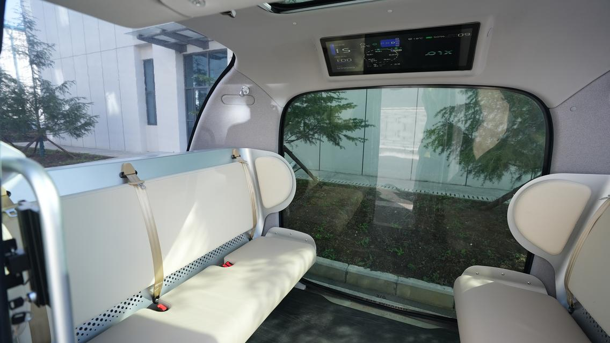
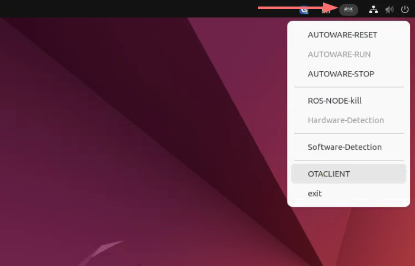
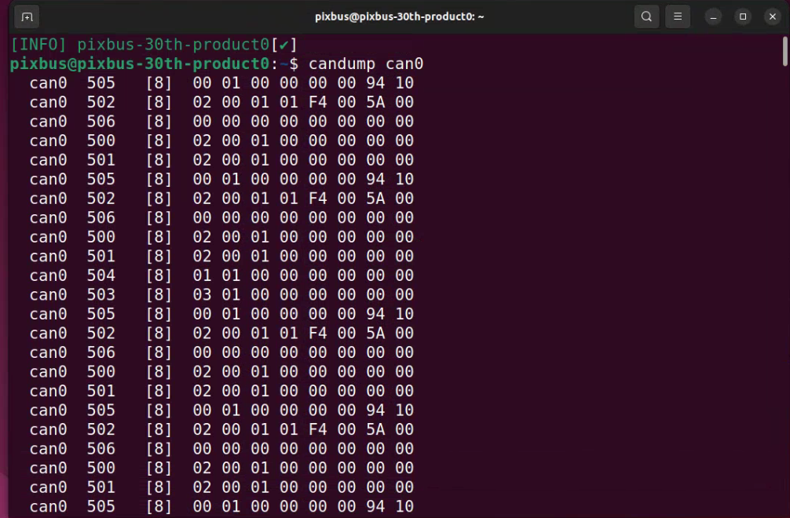
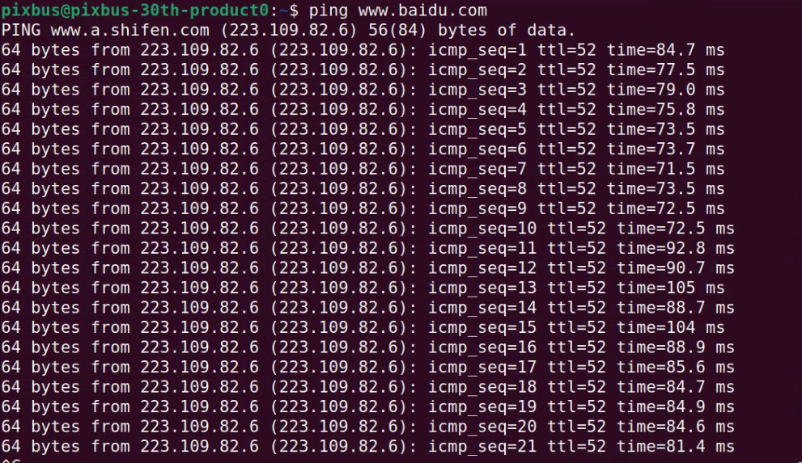
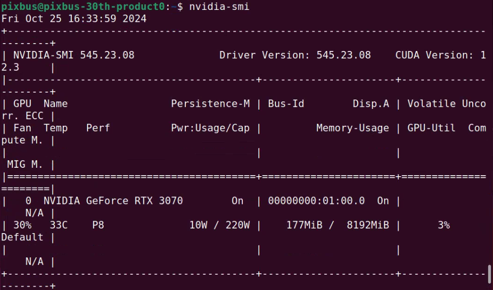

# IPC Operation

## Device Wiring
- The in-vehicle display is connected to the IPC, providing a visual interface.



## IPC Device Inspection
- After powering on the vehicle, wait a few seconds for the interface to appear.


- **Autonomous Driving Start Button**: Located at the upper right corner with the PIX logo. Click to reveal the drop-down menu.



1. **RESET**: Check if the autonomous driving system is functioning normally. Reset before starting the autonomous driving.
2. **RUN**: After RESET, click RUN to start the autonomous driving system and wait for the system to operate.
3. **STOP**: After the autonomous driving operation is complete, turn off the autonomous driving system.
4. **KILL**: If an exception occurs during the STOP of the autonomous driving, click KILL to forcefully terminate it.
5. **Hardware**: Check autonomous driving-related hardware.
6. **Software**: Check the autonomous driving software.
7. **OTA**: System upgrade, currently in development and not available for use.
8. **EXIT**: Exit the PIX interface; do not use this option.

**Launch the terminal with Ctrl+Alt+t**: Username: pixbus, Password: pixmoving

**Check if the chassis data communication is normal**:
```shell
candump can0
```
- Terminal output should show normal data:



- Check if network communication is normal:



- Check if the graphics card driver is functioning properly:

