# Autonomous Driving Hardware Inspection

## LiDAR Inspection
- Launch the terminal with Ctrl+Alt+t: Username: pixbus, Password: pixmoving
1. Left Front LiDAR IP: 192.168.1.120
2. Right Front LiDAR IP: 192.168.1.122
3. Left Rear LiDAR IP: 192.168.1.123
4. Right Rear LiDAR IP: 192.168.1.121

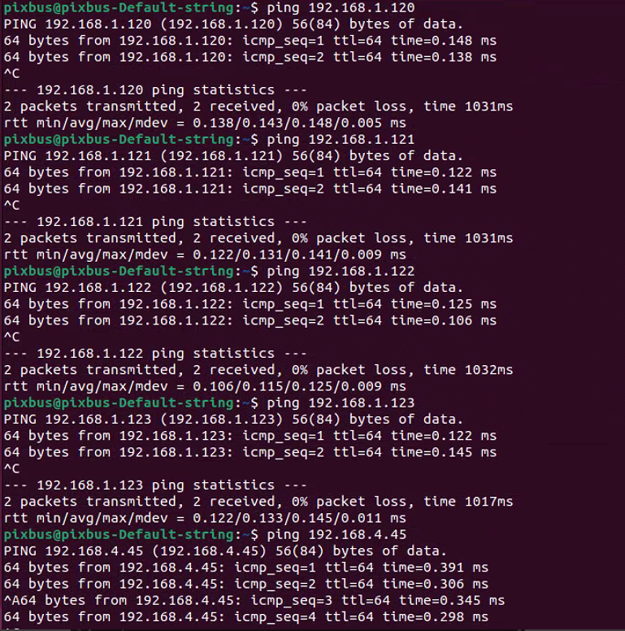
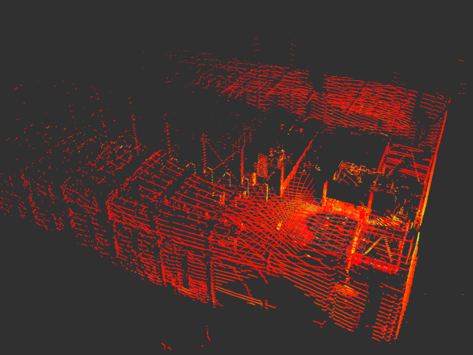

## GNSS Inspection
### Login to the Integrated Navigation Interface
- Open a browser and enter the address 192.168.4.45 in the address bar. A login interface will appear. Username: admin, Password: password.

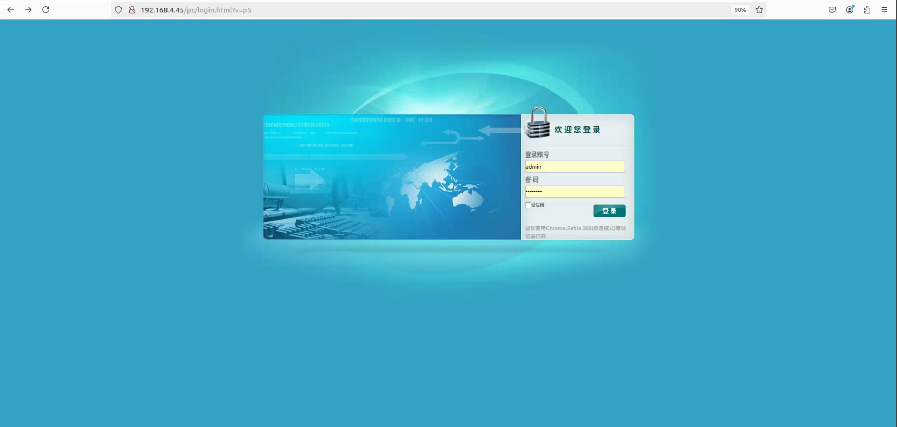

- Navigate to the IO Configuration interface, select “RTK Client,” click “Connect.” You can choose NTRIP/TCP/APIS protocol, enter the relevant account and password, and then click “OK.”

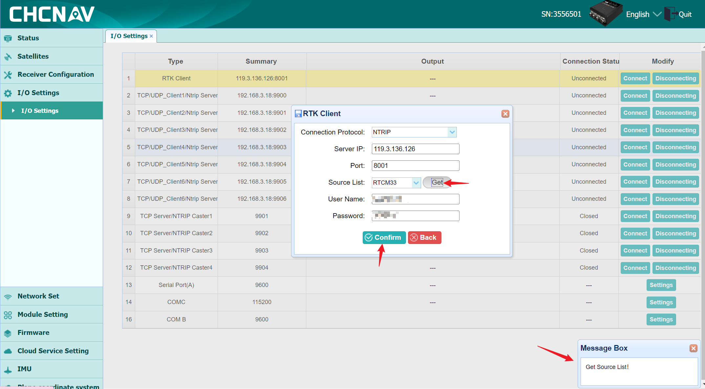

**Note 1**: Do not open in Firefox, as parameters may not be successfully modified.

**Note 2**: When retrieving the source list, ensure that the success message appears in the lower right corner. Otherwise, RTK login will fail. Check if the device is supplied with network.

**Note 3**: RTK supports foreign differentials, but it must ensure that the base station broadcasts standard RTCM statements. Both domestic and international systems support satellites: GPS, Beidou, Galileo, GLONASS, and Quasi-Zenith.

### GNSS Calibration
- Real Vehicle Operation: The INS mode first uses satellite navigation, then initializes, and finally combines inertial navigation. The vehicle must be taken outdoors, preferably in an open area without tall obstructions. The vehicle undergoes GNSS calibration before leaving the factory, ensuring RTK and network functionality. The vehicle should drive at a speed of 15 km/h for about twenty minutes for successful calibration. If the INS mode remains unchanged, check whether the RTK account has successfully logged in and if the network communication is normal.
1. Inertial Navigation Status: INS mode is Satellite Navigation;
    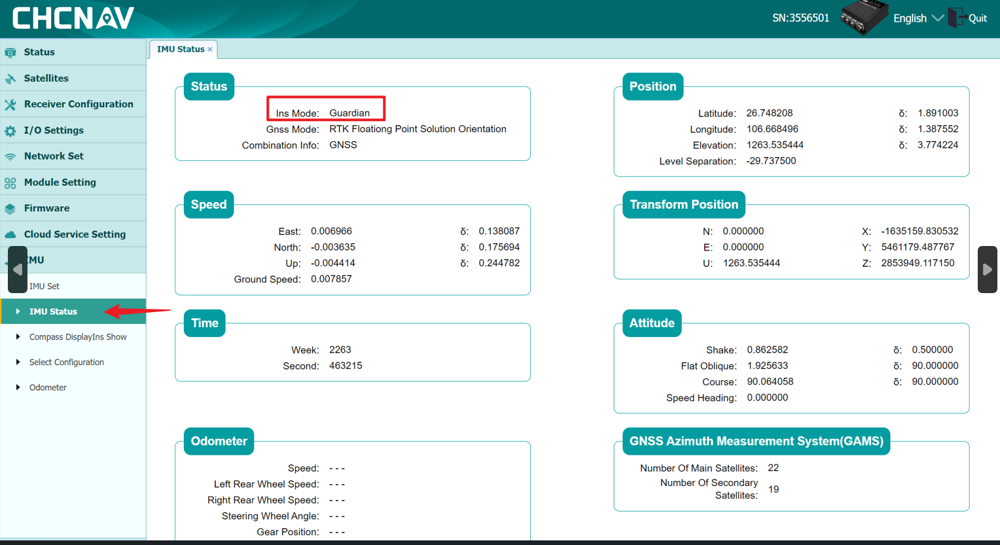
2. Inertial Navigation Status: INS mode is Initialization;
    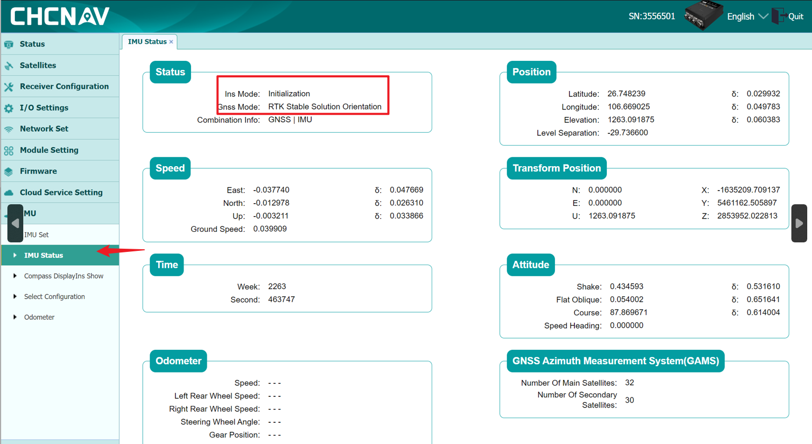
3. Inertial Navigation Status: INS mode is Combined Inertial Navigation; combination information is GNSS | MIU
    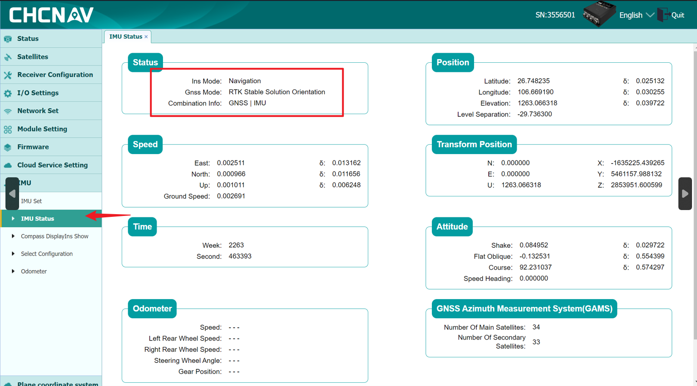

## Camera Inspection
- Remote Monitoring Camera \*7: Below Left Front Radar \*1, Below Right Front Radar \*1, Below Left Rear Radar \*1, Below Right Rear Radar \*1, Directly in Front \*1, Directly in Rear \*1, Inside the Car \*1;

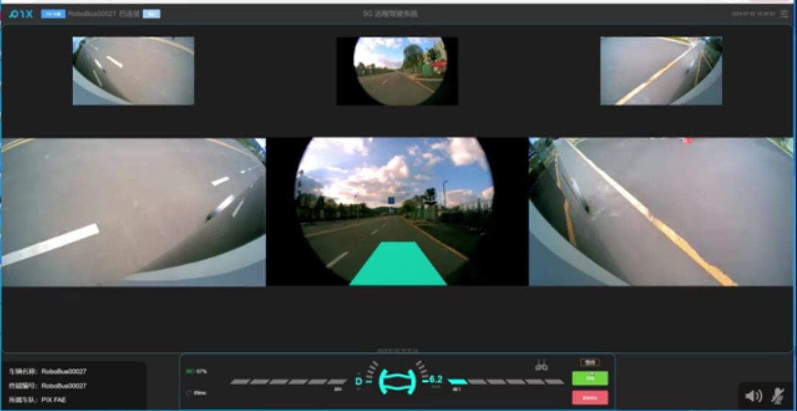

- Visual Perception Cameras\* 2 ：Front of vehicle\* 1, Front top of vehicle\* 1

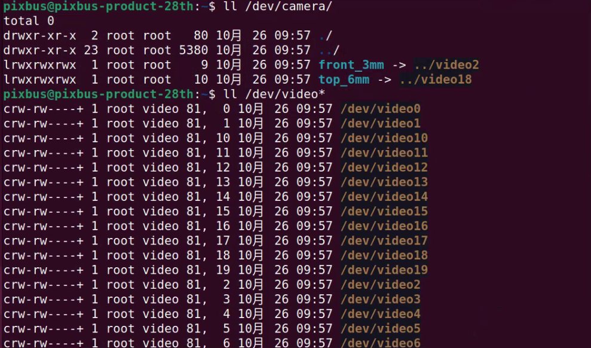
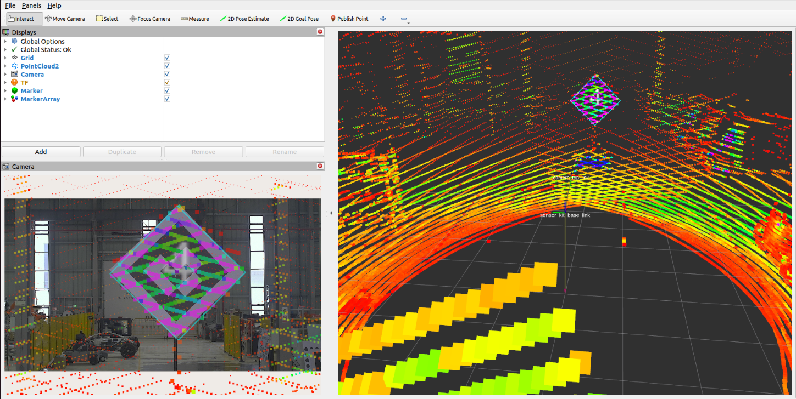

## Ultrasonic Radar Inspection
- Ultrasonic Radar Probe\*12: Front\*4,Rear\*4, Left\*2, Right\*2.

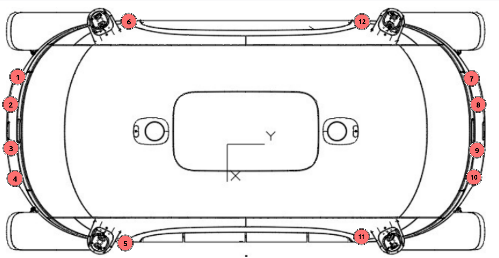
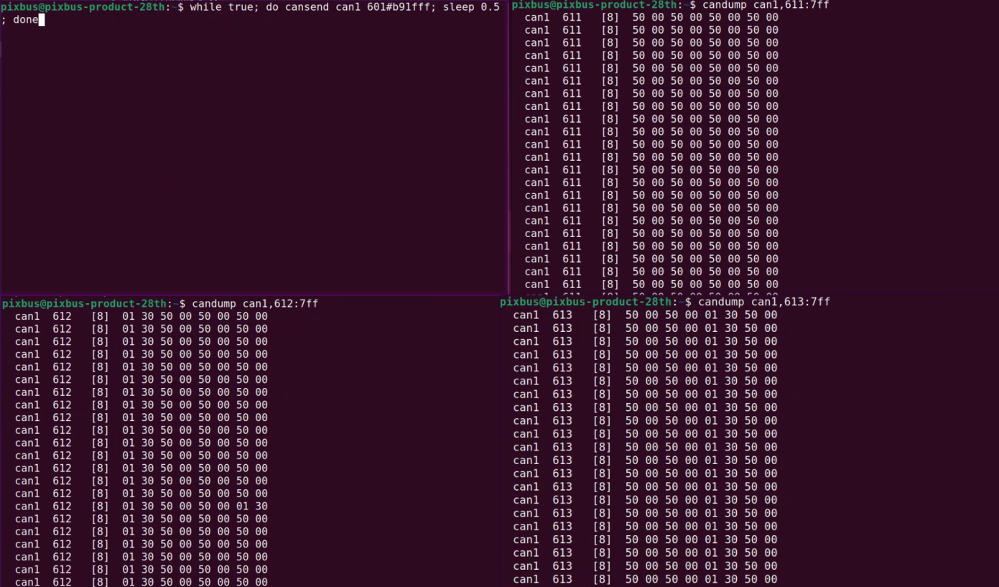

