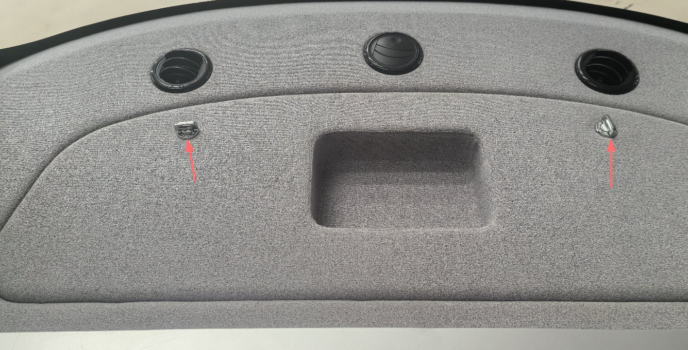
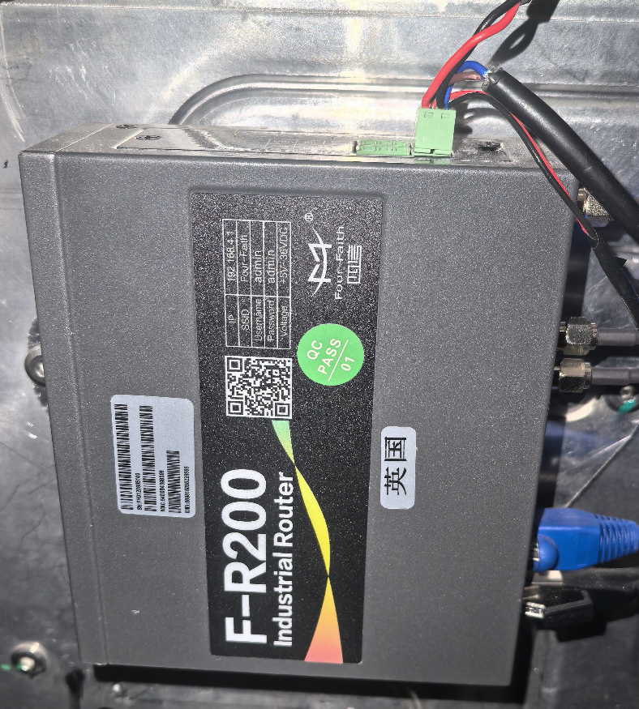
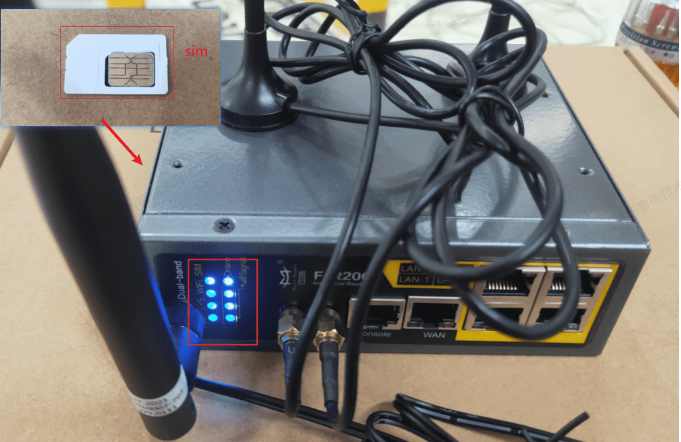

# Router Hardware Inspection

- The domestic RoboBus router is located on the left side of the rear compartment, while the international RoboBus router is on the left side of the front compartment (for Hong Kong and Macau). You can see it by opening the compartment cover.

- Open the rear cover, disconnect the router's power cable, and use a screwdriver to remove the metal plate that holds the SIM card. Insert the SIM card, power on the device, and if all indicator lights show normally, it indicates successful network connectivity, allowing for normal internet usage.

- Refer to the router's user manual:  [F-R200](./image/F-R200.pdf)

**Note**: Ensure you locate the router before starting the device and prepare the IoT card (overseas customers need to prepare their own IoT card, including those for Hong Kong and Macau).