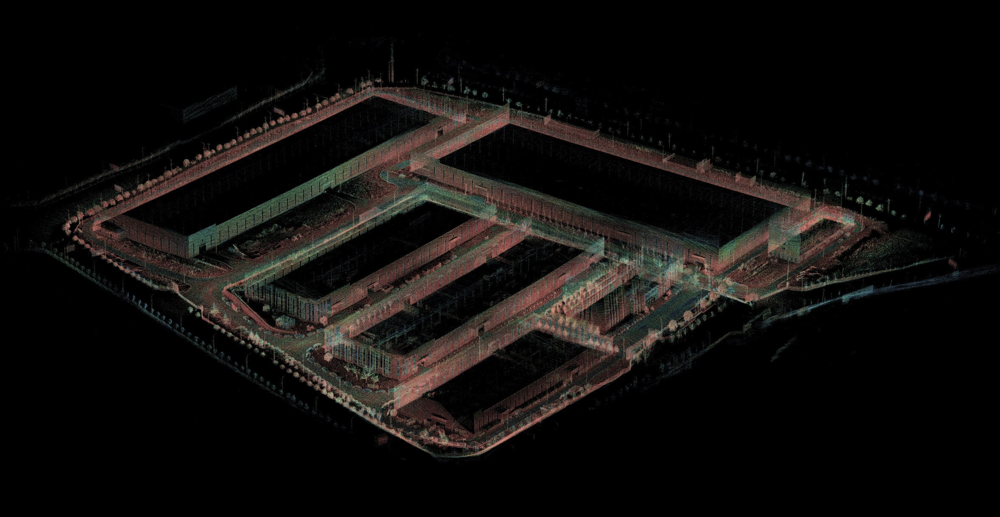

# High-Precision Map Creation

## Data Collection Preparation
1. Ensure that the IPC network connection is normal.
2. Verify that data from the four radars is communicating properly with the IPC.
3. Confirm that RTK is logged in and GNSS calibration is successful.
4. Ensure that the chassis CAN communication is normal.

## Starting the Autonomous Driving System
1. Click on the PIX icon in the upper right corner, then click **RESET** to check the system. Once the script execution is successful, click **RUN** and wait for the autonomous driving system to start, observing the progress bar.


- RVIZ should start successfully, and the laser point cloud should display normally.


2. Check the following topic data:
```
/sensing/lidar/concatenated/pointcloud_raw    *Ensure the field displays completely*
/sensing/imu/imu_data
/sensing/gnss/fix
```
- Retrieve the topic data and check for normal output and frequency:
1. Confirm that fused point cloud data outputs normally at a frequency of 10Hz.
2. Ensure IMU data is normal, outputting at 100Hz.
3. Verify that Fix data is normal, outputting at 10Hz.

```
ros2 topic echo /sensing/lidar/concatenated/pointcloud_raw
ros2 topic echo /sensing/imu/imu_data
ros2 topic echo /sensing/gnss/fix
```


```
ros2 topic hz /sensing/lidar/concatenated/pointcloud_raw
ros2 topic hz /sensing/imu/imu_data
ros2 topic hz /sensing/gnss/fix
```


**Note**: It is essential to follow the requirements for checks; otherwise, mapping may fail.

## Starting to Record Topic Data
1. Open the terminal and navigate to the desired directory:
```
ros2 bag record /sensing/lidar/concatenated/pointcloud_raw /sensing/imu/imu_data /sensing/gnss/fix
```


- Move the vehicle to the route where autonomous driving will be operated.
- Collect data along the operating route. After starting the recording script, the vehicle should remain stationary for about 10 seconds to allow IMU data to converge before starting to operate the vehicle. The vehicle should stop at traffic light locations. During data collection, the vehicle must maintain a steady speed, not exceeding 15 km/h, and should not exceed 8 km/h when turning. Avoid sudden acceleration.
- During the data recording process, ensure loop detection is performed to avoid IMU data not converging with point cloud data, leading to mapping failure.

2. Data Processing
- After data recording is complete, check the data size. If it exceeds 2G, split the data into packages of 2G each.
- Once the data is split, contact a PIX engineer to upload the data to the PIX server for mapping.
- The PCD map will be completed approximately one working day later.

