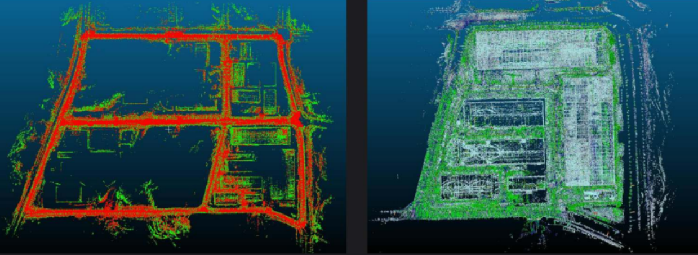

# High-Precision Maps

Autonomous driving maps consist of point cloud maps and vector maps, which assist autonomous vehicles in functions such as localization, navigation, perception, decision-making, and control.

## Methods for Creating Point Cloud Maps and Vector Maps
- [Point Cloud Map](./Point%20Cloud%20Map.md)
- [Lanelet2 Map](./Lanelet2%20Map.md)