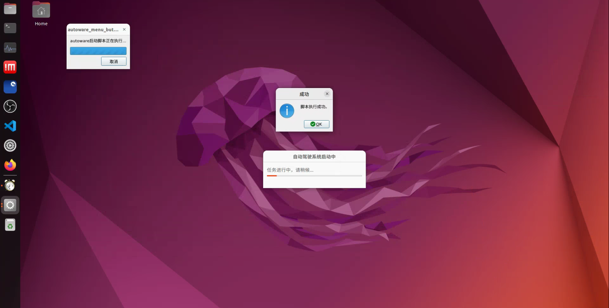
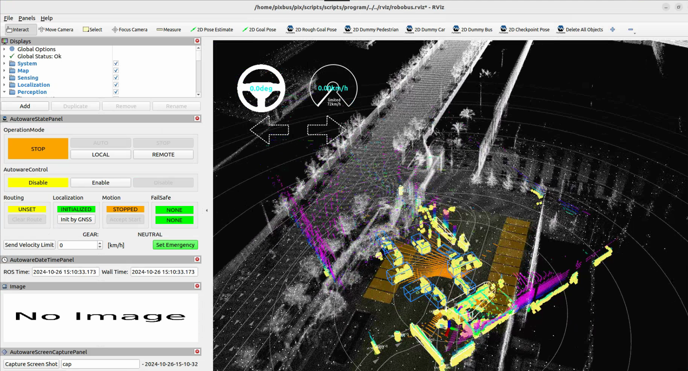
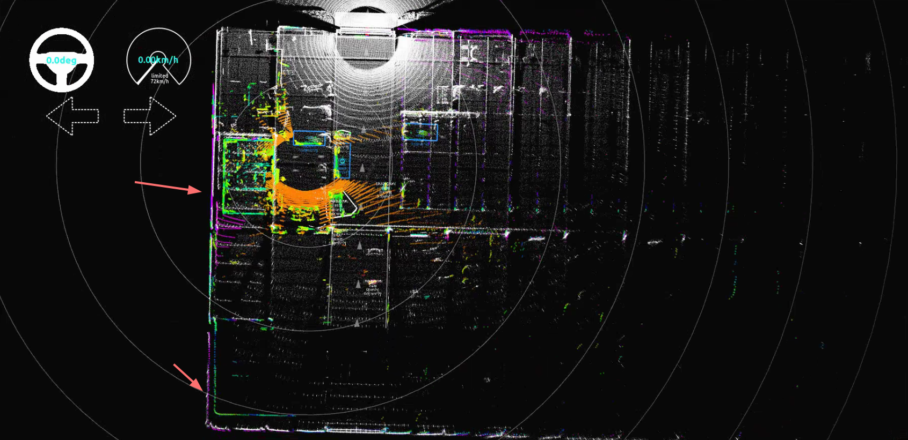
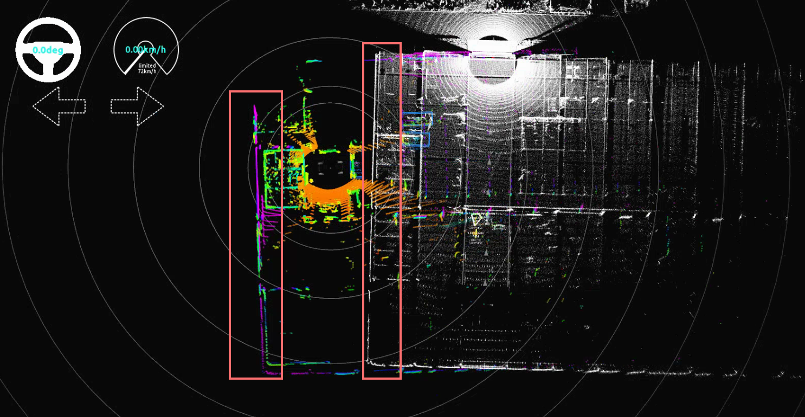
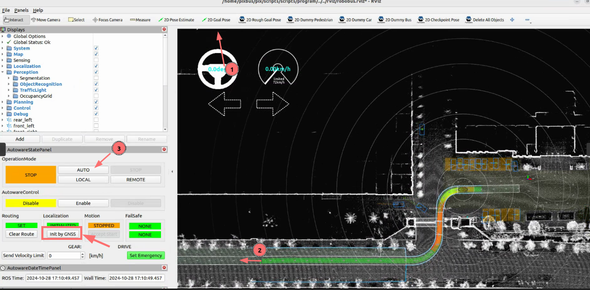
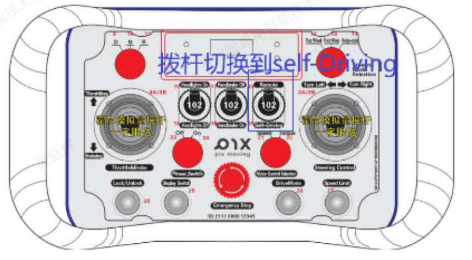
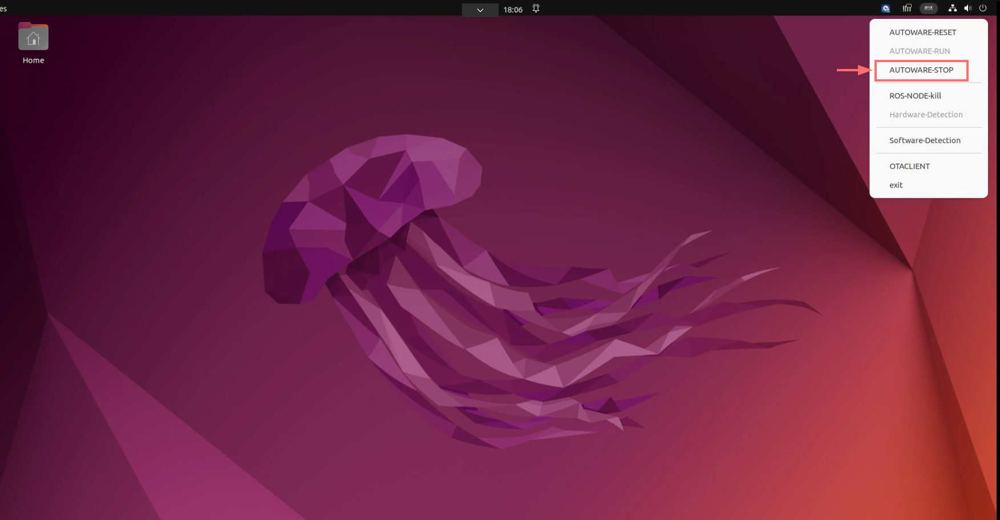
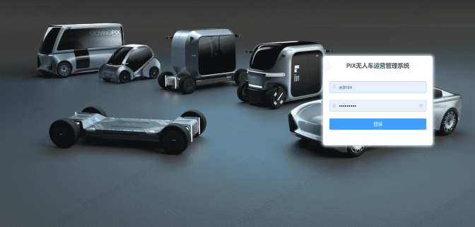
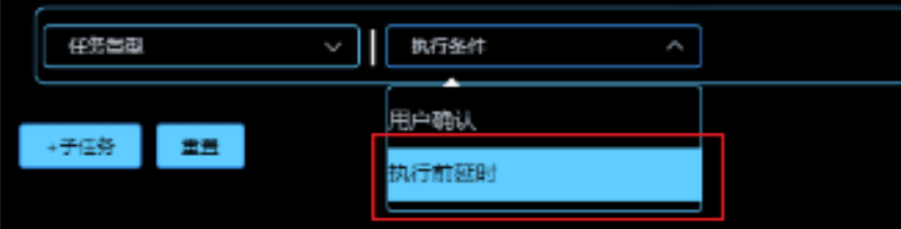
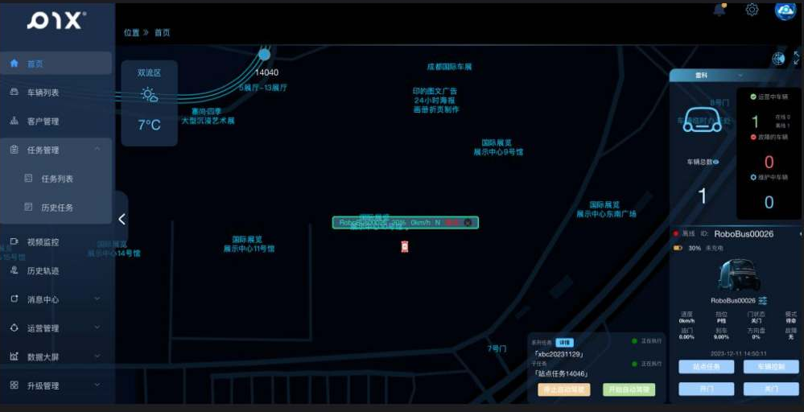

# Autonomous Driving Operation

**Map Files Completed**

1. Click on the PIX icon in the top right corner, then click RESET to check the system. Once the script execution is successful, click RUN and wait for the autonomous driving system to start, indicated by the progress bar.

- RVIZ starts successfully, and the laser point cloud displays correctly.

### Localization Check

- After starting, point clouds will appear. Check if localization is normal.
- Normal Localization: When the colored point cloud and the white point cloud map's fixed structures overlap, it indicates successful localization.

- Localization Failure: If the colored real-time point cloud and the point cloud map’s structures are separated, it indicates localization failure.

- If unsuccessful, reinitiate localization by clicking the **init by GNSS** button in the RVIZ control panel. Then check if localization is successful. If not, repeat the process, allowing about 30 seconds between each click.

### Autonomous Driving Operation

- Set the target station by clicking the **2D Goal Pose** toolbar button, then click on the vehicle’s target position (the direction should match the lane).
- If done correctly, you will see a planned path from the initial pose to the target pose.
- Click the **AUTO** button, then release the remote control; the vehicle will drive along the planned path.

### Important Notes
1. Choose a clear and obstacle-free area for vehicle operation.
2. Set the vehicle speed; for unfamiliar operations, it is recommended to keep the speed below 5 km/h.
3. Ensure that there are no pedestrians or other vehicles within 5 meters of the vehicle.

### Stopping Autonomous Driving

- To stop the autonomous driving program, click the **AUTOWARE-STOP** button.

# Cloud Control Platform (Not Supported Overseas)

- **Task Issuance via Cloud Control Platform**: Use the cloud control platform to issue autonomous driving tasks; refer to the cloud control platform user manual for details.

1. After the task is issued, check if it was successfully sent; a green driving route indicates success. If unsuccessful, resend the task.
2. If the task execution condition is set for delayed execution, wait for the delay time to elapse for autonomous driving to start.

3. If the task execution condition requires user confirmation, the user must click the **Start Autonomous Driving** button on the iPad to initiate.

