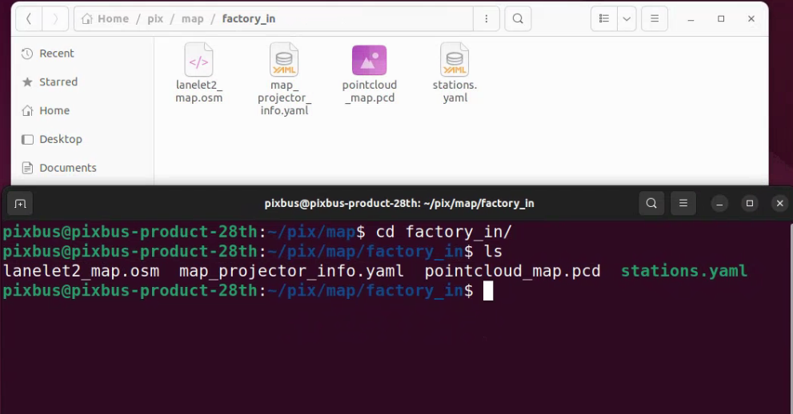
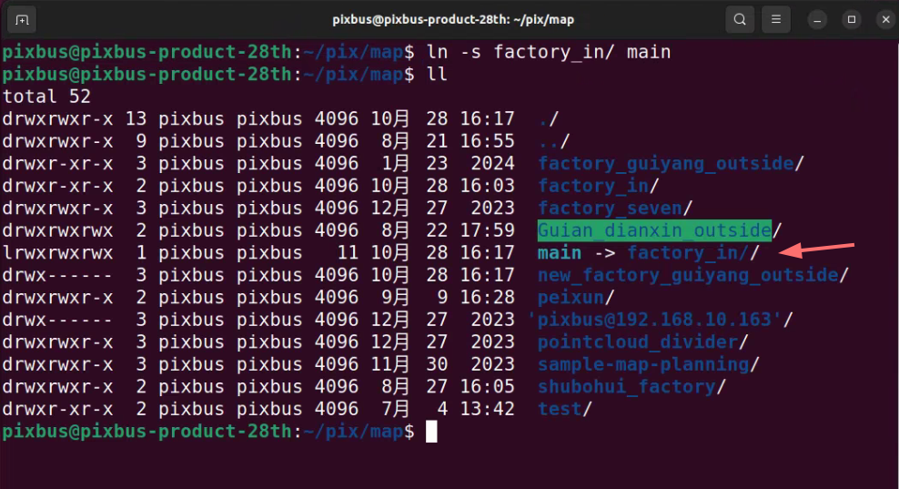

# High-Precision Map Files

- **PCD File**: Generated from data collection to create the point cloud map.
- **Lanelet2 File**: Vector map drawn based on relevant road information.
- **YAML File**: Outputs coordinate origin information during mapping.
- **Station File**: Information on operational route stations (optional).

### Steps to Organize Map Files
1. **Create a New Folder**: In the map directory, create a new folder and place the following files inside:



```
PCD File Name: pointcloud_map.pcd
Lanelet2 File Name: lanelet2_map.osm
YAML File Name: map_projector_info.yaml
Station File Name: stations.yaml (optional)
```
**Note**: Please adhere strictly to the specified file names; otherwise, the map will fail to load.

2. **Create a Soft Link to the Main Folder**:
- E: Create a soft link for the `factory_in` folder to the main directory:



```
ln -s factory_in/ main 
``` 