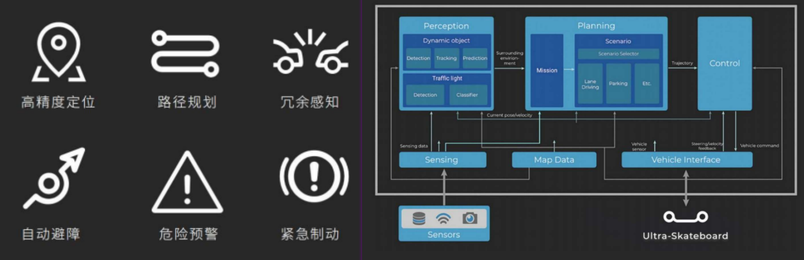

# Autonomous Driving Software Structure
- **PIX Rover** - Autonomous Driving Software Architecture

PIX provides comprehensive L4-level autonomous driving system integration services within a designated area. The autonomous driving system module is the core of the vehicle, integrating both the software and hardware platforms for autonomous driving, enabling real-time communication and data transmission with other modules. This module is designed to command the vehicle's real-time actions, handle immediate response requirements, and implement a redundancy design that reserves mechanisms for manual takeover, remote control, and one-click braking to ensure operational safety.

## Table of Contents
- [High-Precision Map Files](./High-Precision%20Map%20Files.md)
- [Autonomous Driving Operation](./Autonomous%20Driving%20Operation.md)