# Product Introduction

## Usage Instructions

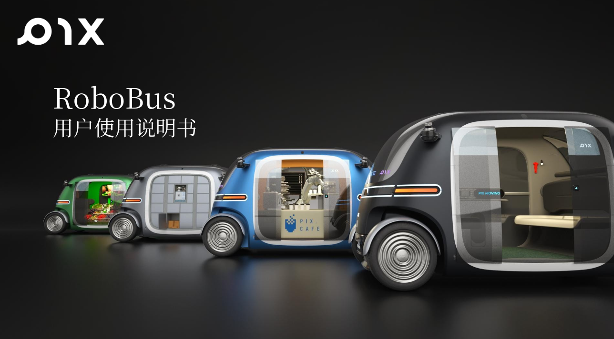

1. Improper use of PIX Moving vehicles carries certain risks. Please ensure personal safety while using the vehicle correctly.  
2. Before using the vehicle, familiarize yourself with the location and operation of the emergency stop button to ensure you can correctly activate the safety protection function in case of an emergency.  
3. No PIX Moving vehicle should be operated completely without personnel supervision.  
4. It is prohibited to use this product in environments that exceed its intended use.  
5. Before using this product, please read the user manual in detail or participate in relevant training. Do not allow individuals who have not undergone operation training to operate the vehicle independently.  
6. If testing in densely populated areas such as streets, supermarkets, or malls, safety measures must be implemented. For example, set up conspicuous warning signs in areas where people and vehicles are present, and close off the vehicle's operating routes when necessary.  
7. Due to the design characteristics of this product, individuals unfamiliar with the structure of PIX Moving products may have difficulty determining the front and rear of the vehicle. Stand to the side of the vehicle when starting it, switch to remote control mode (D), and slowly push the acceleration lever. Identify the front and rear positions while the vehicle moves slowly. During this process, no one is allowed to pass or remain within 10 meters in front or behind the vehicle.  
8. During normal operation, no one is allowed to enter the area within 15 meters in front of the vehicle. In manual remote control mode, the operator must always keep the vehicle within their line of sight and closely monitor changes in the operating environment, promptly warning pedestrians to avoid or stop. In autonomous driving mode, please confirm that the running route is clear in advance and eliminate any safety hazards or potential issues.  
9. The vehicle has been tested and restricted for maximum speed before leaving the factory. It is strictly forbidden to alter the vehicle's basic structure or control software without authorization. Any changes to the vehicle's structural parameters due to operational needs must be confirmed by PIX Moving and carried out under the guidance of PIX Moving's professional engineers. If changes are made without confirmation, resulting in vehicle damage or safety incidents, PIX Moving will not assume any responsibility.  
10. If the vehicle experiences any abnormal issues, such as brake failure or steering failure, it must be immediately stopped. To ensure the safety of personnel and property, it is forbidden to operate a malfunctioning vehicle.  
11. During normal operation, the emergency stop button should be avoided unless absolutely necessary. The emergency stop function is a safety measure and should not be used when there is no safety risk. A sudden emergency stop while the vehicle is traveling at high speed may cause mechanical damage and lead to future safety risks.  
12. Non-professional personnel must not disassemble or repair the vehicle independently.

## Product Overview

RoboBus is a fully electric, autonomous bus designed with a distributed mid-mounted motor, highly integrated controller, high-energy lithium iron phosphate battery, and an intelligent autonomous driving suite. It is a smart autonomous driving product developed by PIX Moving.

**Vehicle Exterior Rendering**

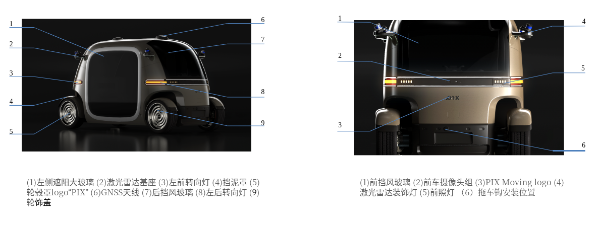
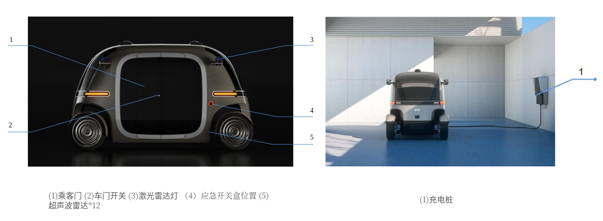
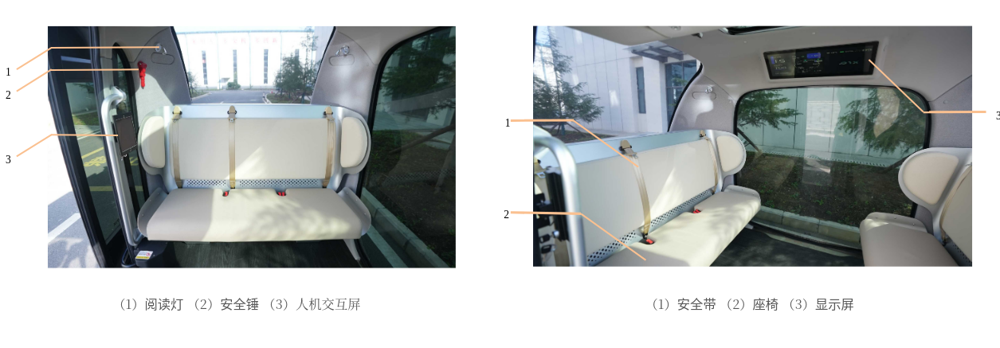
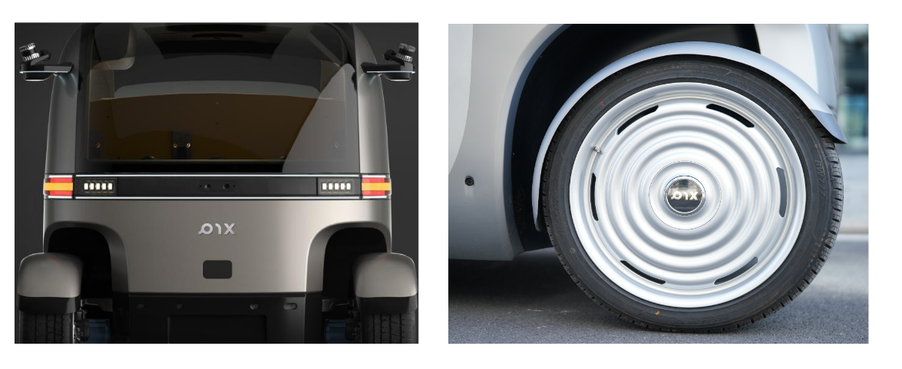

## Safety Instructions
### Seatbelt
1. Seatbelt Usage Instructions: Sit in the correct position, pull out the seatbelt, and position the lap belt as low as possible across your hips. Insert the buckle tongue into the latch until you hear a “click.” Gently pull the tongue in the opposite direction to confirm it is locked. Make sure the seatbelt is not twisted.
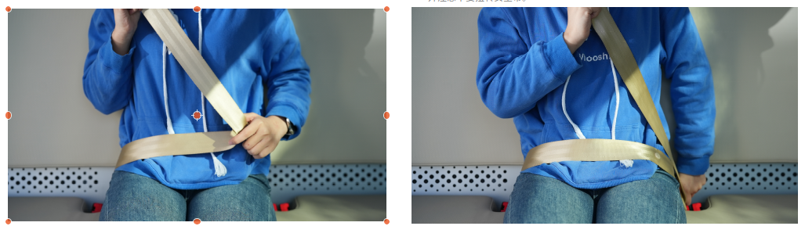
2. Releasing the Seatbelt: Press the red release button on the buckle, and the tongue will pop out, allowing the seatbelt to retract automatically. If the seatbelt does not retract, pull it out to check for any twisting.
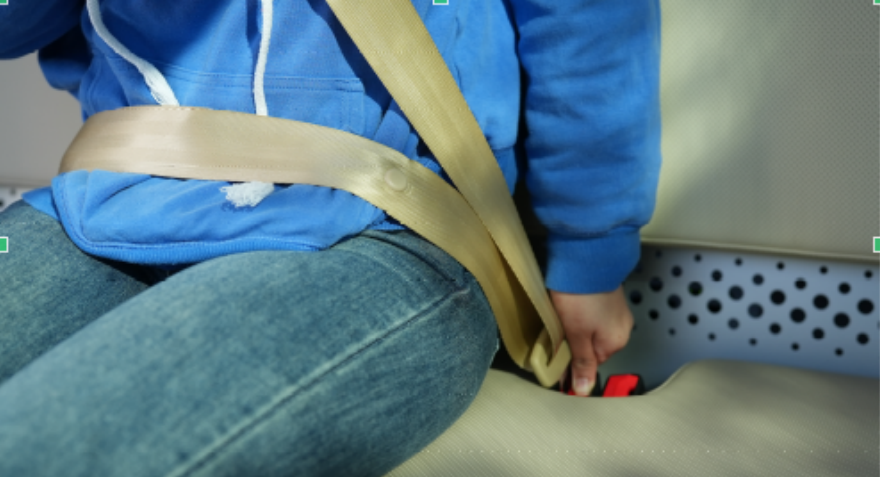

**Notice**

- During travel, always wear your seatbelt properly. When fastening or unfastening, ensure the seatbelt is not twisted; a twisted seatbelt reduces its width and cannot absorb impact forces effectively in a collision.
- Before the vehicle starts, ensure all passengers have correctly fastened their seatbelts to protect them in case of emergency braking or collisions. If a seatbelt is not correctly worn while driving, the vehicle will issue a continuous voice reminder.
- The seatbelts in the vehicle are designed primarily for adults and are not suitable for children.
- Position the lap belt as low as possible across the hips rather than over the abdomen. In an accident, a seatbelt across the abdomen may cause injury.
- The seatbelt should fit closely to the body for optimal protection.
- Each seatbelt is designed for use by one person only. Do not allow multiple people (including children) to share a seatbelt.
- Regularly inspect the seatbelt for cuts, wear, looseness, or other abnormalities.
- Do not disassemble, modify, or alter the seatbelt without authorization.
- After a severe accident, replace the seatbelt and seat assembly together, even if there is no visible damage, and conduct a thorough inspection.
- Avoid inserting foreign objects like coins or paper clips into the buckle, as they may obstruct proper connection between the latch and buckle.
- If a seatbelt shows any signs of damage or abnormality, do not use the corresponding seat and immediately contact after-sales service for confirmation and repair.

### Emergency Stop Button

**In-Vehicle Emergency Stop**

- In case of a critical situation requiring immediate stopping while driving, press the in-vehicle emergency stop button to stop the vehicle immediately. The emergency stop button is located on the left side of the vehicle’s interior.
- After the emergency situation is resolved, turn the button clockwise, following the marked instructions, to deactivate the emergency stop mode.
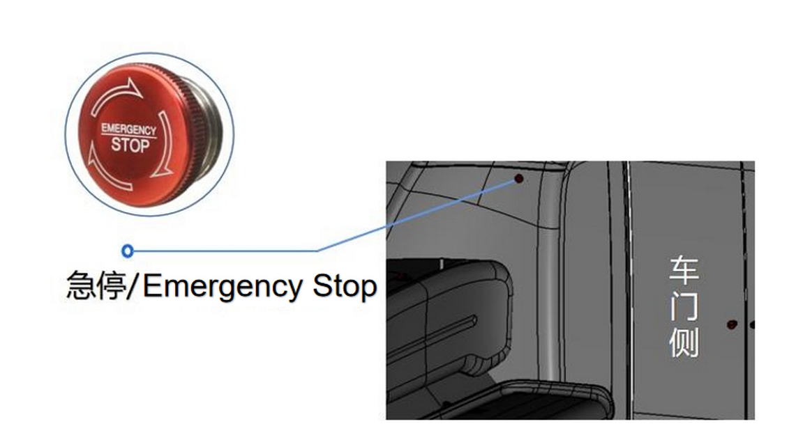
**Remote Control Emergency Stop Button**

- If a critical situation arises while the vehicle is in remote control mode and requires immediate stopping, press the emergency stop button on the remote to stop the vehicle instantly.
- After the emergency situation is resolved, turn the button clockwise as indicated to exit emergency stop mode.
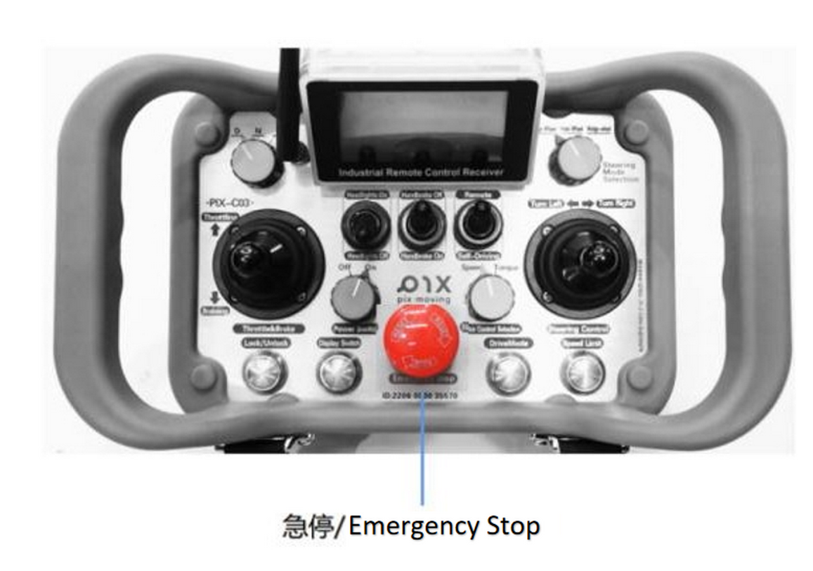
**Safety Hammer Operation**

- In an emergency, remove the safety hammer located on the right rear pillar inside the vehicle, and break the side or sunroof glass to create an emergency exit.
- Strike the edge of the glass for a safer and more effective break.
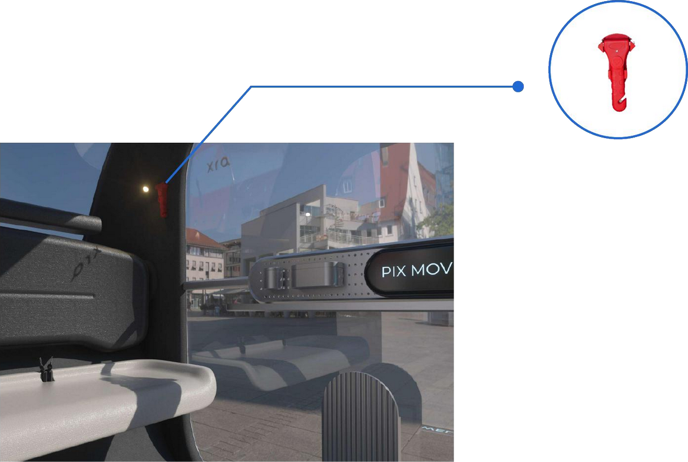
**Warning**:

- Before starting the vehicle, ensure the safety hammer is intact and functioning properly.
- Do not allow children to remove or play with the safety hammer, as it may lead to injury.
- Avoid direct contact with glass fragments to prevent injury.
### Data Recording System

The vehicle's data recording system is primarily used to collect and store critical data in real-time during vehicle operation. The stored data is especially valuable for accident analysis and determining liability.。

**Extracting Vehicle Data from the Recorder**:

- The data files generated by the system are stored on the device's SD card. To extract files from the data recorder, gently insert a card ejector tool into the card slot's opening, and the slot will automatically eject the SD card for removal.

- Insert the SD card into a dedicated card reader (provided by the customer), then connect the card reader to a computer to extract and copy the file data.

- After extracting the files, customers should contact the PIX Moving after-sales service center for analysis and interpretation.

**Indicator Light Functionality**:

**A** Normal System Operating Status:

- Left 1 Indicator Light On: Indicates that the power supply is normal and the SD card is properly inserted.
  
- When the Left 1 light is on, observe the Left 2, Left 3, and Left 4 lights flashing in a regular pattern: This signifies that the system is functioning correctly and is actively recording data.

**B** Abnormal System Operating Status:

- Left 1 Indicator Light Off: Indicates an abnormal power supply to the recording system.
  
- Troubleshooting Steps: 
    1. Check if the power supply is providing normal power to the data system.
    2. Inspect the DB15 power interface for poor connection.

- Left 1 Indicator Light Blinking Every 3 Seconds: Indicates normal power-up, but the SD card is not inserted correctly.
  
- Troubleshooting Steps: Follow the procedures in section 2.5.1 to remove the SD card, wait for 10 seconds, then reinsert the SD card into the data recording system. Wait for 5 seconds and check if the Left 1 light becomes solid. If these steps do not resolve the issue, please contact the PIX Moving after-sales service center.
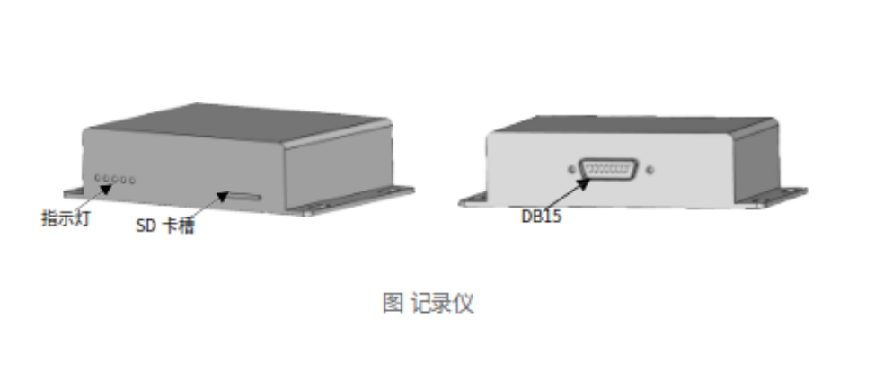
