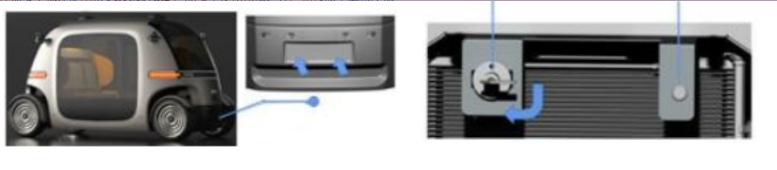
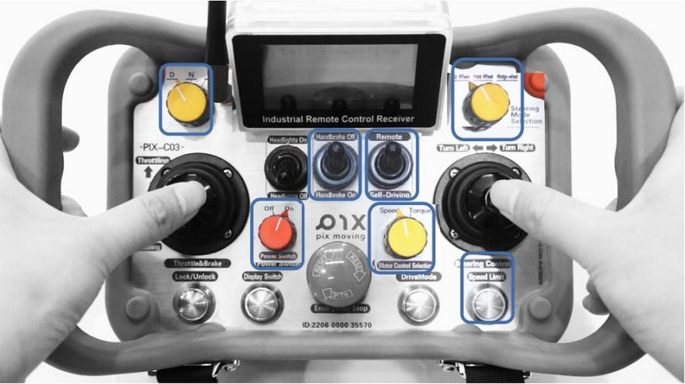
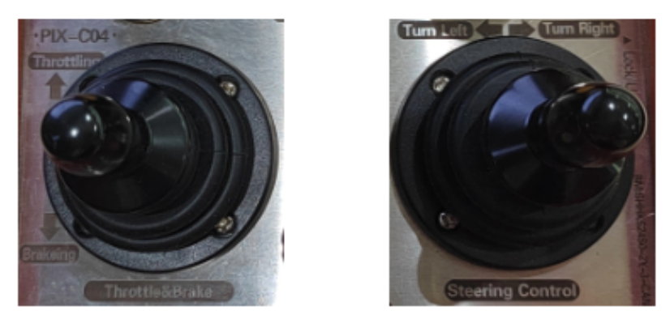
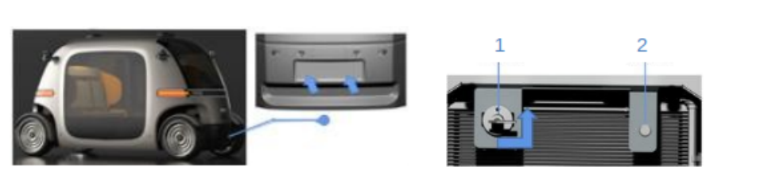
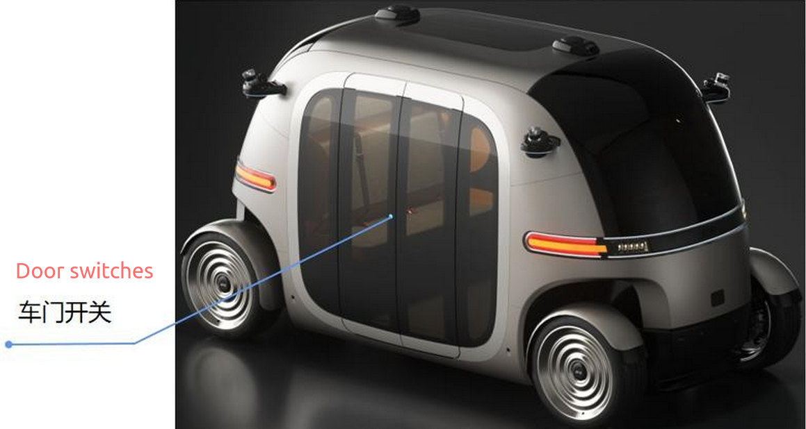
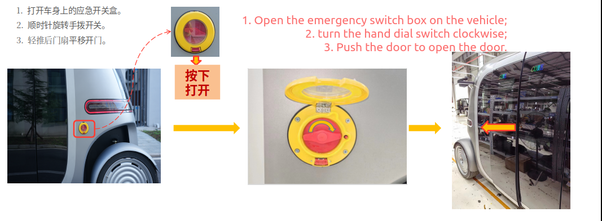
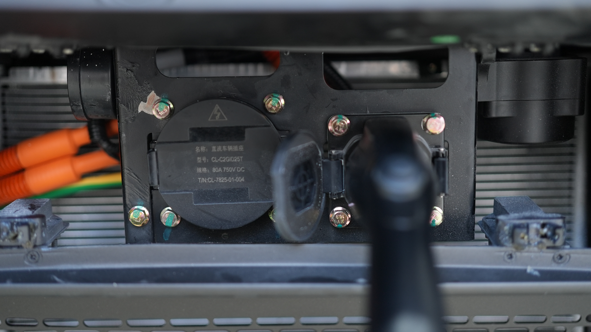
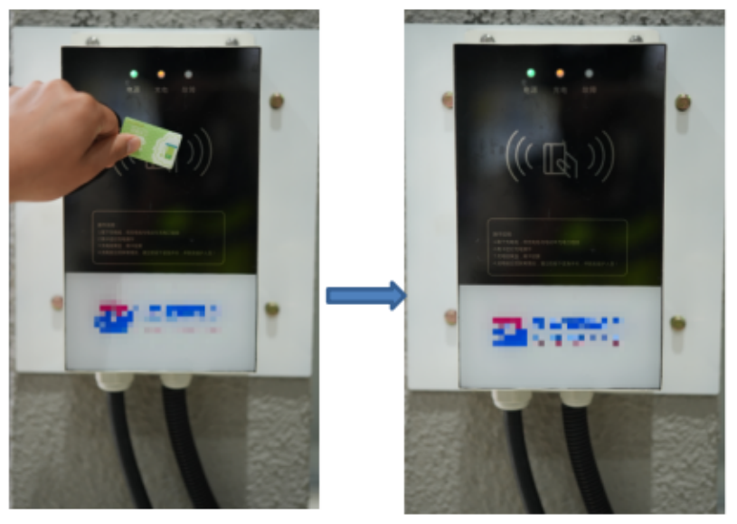

# Vehicle Operation Instructions
## Remote Control Usage
The vehicle can be operated using a portable remote control for movement and parking. Please read the remote control safety operation tips and the PIX Moving product safety guidelines before operating the vehicle, and strictly follow the steps below.

**Vehicle Startup**
- At the location of the front license plate frame, gently press the lower side of the cover plate with both hands. Release your hands, and the cover plate will automatically pop open.

- After lifting the cover plate, rotate the main power switch clockwise to the 90° position to turn it on.

- Once the main power switch is on, press the start switch to turn on the vehicle. If the startup is successful, the indicator light on the switch will display green. If the light does not turn green, the vehicle has not started successfully.

- After turning on the switch, the vehicle will enter a power-on self-check mode. Wait for 5 seconds before starting to use the vehicle.

**Remote Start**: The remote control can manage the vehicle's steering, braking, parking, and driving functions.
- Rotate the power switch on the wireless remote control to the ON position to turn on the remote.
- Rotate the gear switch to the D position (forward gear).
- Switch the control mode to Remote mode.
- Switch the motor control mode to Torque mode.
- Press the speed limit button to switch to Low Speed mode; the remote control screen will display a "Low Speed" prompt.
- In the upper right corner, switch the steering mode to Four-Wheel Steering.
- Once the remote is powered on, set the parking lever to Off to release the parking brake and enter remote control mode.

**Driving the Vehicle in Remote Mode**: Confirm the button positions as described above, and if everything is correct, you can start moving the vehicle.

- Accelerating and Decelerating in Remote Mode: Push the remote control throttle/brake joystick upward to accelerate, and push it downward to activate the vehicle's electronic braking.

- Steering Control in Remote Mode: Move the remote control steering joystick to perform electronic steering operations for the vehicle.

**Turning Off the Vehicle**: After use, park the vehicle in a suitable location; do not park on a slope. Follow the steps below to complete the shutdown process.

- Set the gear switch to the N position, set the remote control parking lever to Handbrake On, and turn off the remote control power switch.
- Gently press to open the power switch cover located at the lower part of the vehicle.
- After lifting the cover, press the start switch (marked as 2 in the image) to turn off the vehicle. If the shutdown is successful, the indicator light on this switch will go out.
- After the start switch is turned off, if the vehicle will not be used for more than 10 days, rotate the main power switch (marked as 1 in the image) counterclockwise by 90° to turn off the vehicle's main power supply. The vehicle will be completely powered down.

**Note**: Please pay attention to the order of operations to avoid damaging the vehicle when powering down.

## Door System

1. Passenger Use  
   The door is equipped with a pinch-proof feature. The door can be opened and closed using buttons, with one button located in the center of the inside of the door and another in the center on the outside. The operation method involves briefly pressing the button for 1 second to perform the corresponding opening or closing action (after disconnecting the mechanical main power switch, the door controller must be activated by briefly pressing the door button for 1 second).

2. Emergency Opening Method for Passenger Door  
   - The external emergency switch and the internal emergency pull handle should only be used when the passenger door cannot be opened or closed using the button.
   - The emergency switch and handle are pull-cable types; significant force is required to forcibly open them when rotating the switch and pulling the handle.
   - Regularly check the lubrication of the door pump and ensure that bolts and nuts are not loose.
   

**Note**: After using the emergency switch to open the door, please contact the PIX Moving after-sales service center for a status confirmation before continuing to use the door system.

## Vehicle Charging Instructions

1. Charging the Vehicle
- Before charging the vehicle, please install the charging pile according to the PIX Moving "7KW Charging Pile Installation Specifications" and carefully read the charging pile user manual.
- Ensure the vehicle is powered down, and the mechanical switch is in the open position.  

- Hold the IC card against the scanning area of the charging pile. After the card scans and you hear a "beep," remove the card. The charging pile will then start charging, and the charging indicator light will remain yellow.

2. Ending Vehicle Charging  
- To manually stop charging during the charging process, scan the card again to end the current charging session; the charging indicator light will go out. If an emergency occurs during charging, you can press the "Emergency Stop Button" located on the right side of the charging pile.
- Once the vehicle is fully charged and the charging pile system automatically cuts off the power, firmly grip the charging gun handle with your right hand, press the unlock button with your thumb, and pull the charging gun straight out with even force.
- Close the protective cover of the charging socket and the charging compartment door, and return the charging cable and gun to their designated storage location.

**Safety Precautions**

- The installation of the charger must strictly follow the PIX Moving "7KW Charging Pile Installation Specifications."
- It is strictly prohibited to store flammable and explosive materials near the charging location, and emergency access routes must not be blocked.
- Before starting the charger, ensure that the connection is fault-free, secure, and reliable, with no short circuits or other faults. The cables should be well-insulated and undamaged. Sharp objects must not be used to operate the charger.
- During charging, any operations unrelated to charging are strictly prohibited. Vehicle repairs, vehicle movement, disconnection of high-voltage maintenance switches, and relocation of the charger are all forbidden.
- After charging is complete, the power must be turned off before unplugging the charging gun. The charging gun should be placed in the designated location, ensuring it is protected from water and dust; the vehicle charging socket cover must be closed. Plugging and unplugging the charging gun while powered is strictly prohibited.
- A dry powder fire extinguisher should be available around the charging facility, and relevant personnel should be trained on how to use it to ensure they can handle emergencies correctly.
- Charging operations outdoors are strictly prohibited during rain or snow.
- In hot, dry summer weather, the risk of fire increases. Ensure proper ventilation in the charging environment and avoid direct sunlight as much as possible.
- Charging is prohibited when the ambient temperature exceeds 45°C.
- Some modules within the charging equipment may produce electrical sparks. To avoid accidents, do not perform charging operations at gas stations or in areas with flammable gases or liquids.