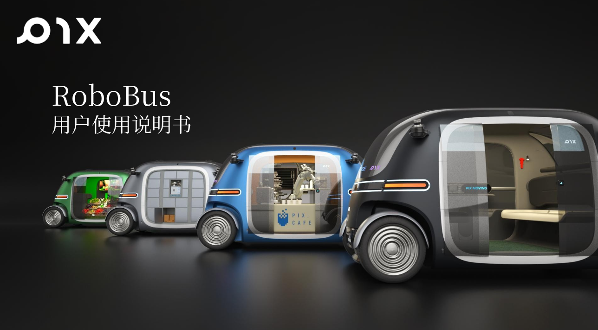
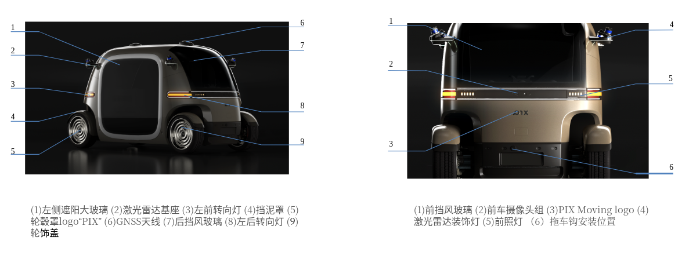
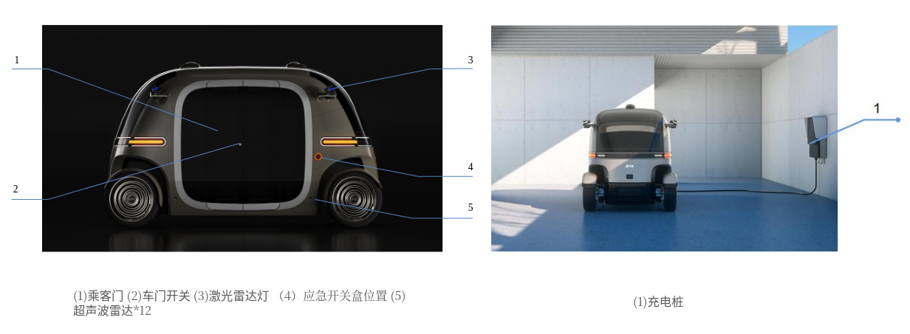
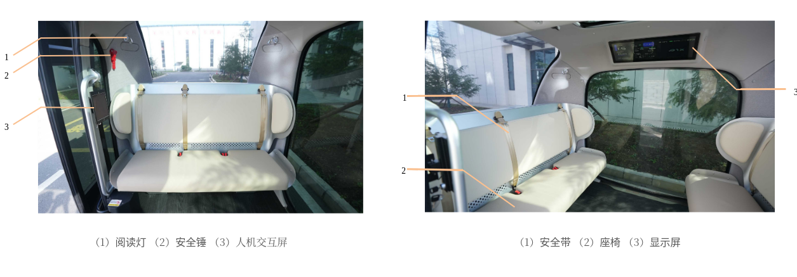
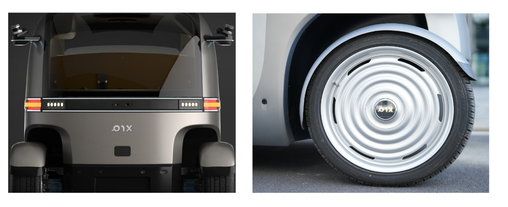
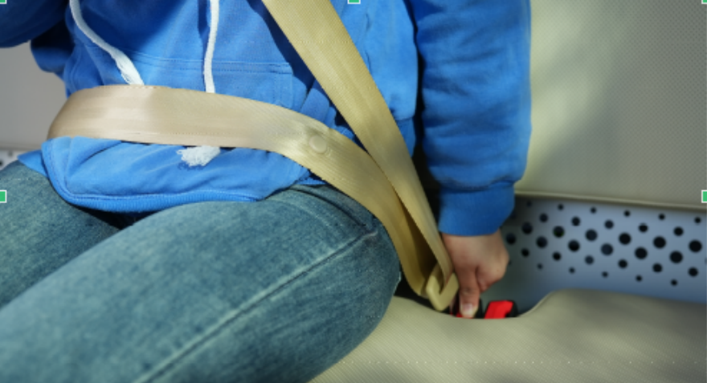
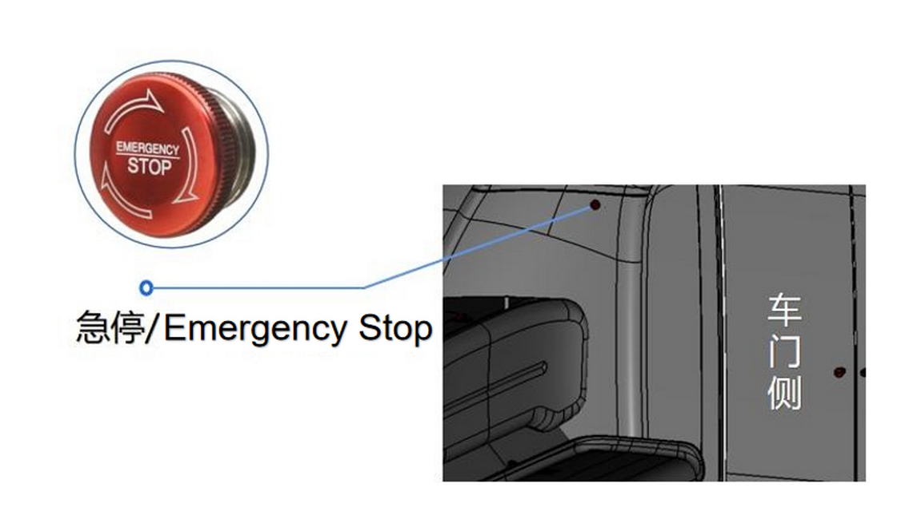
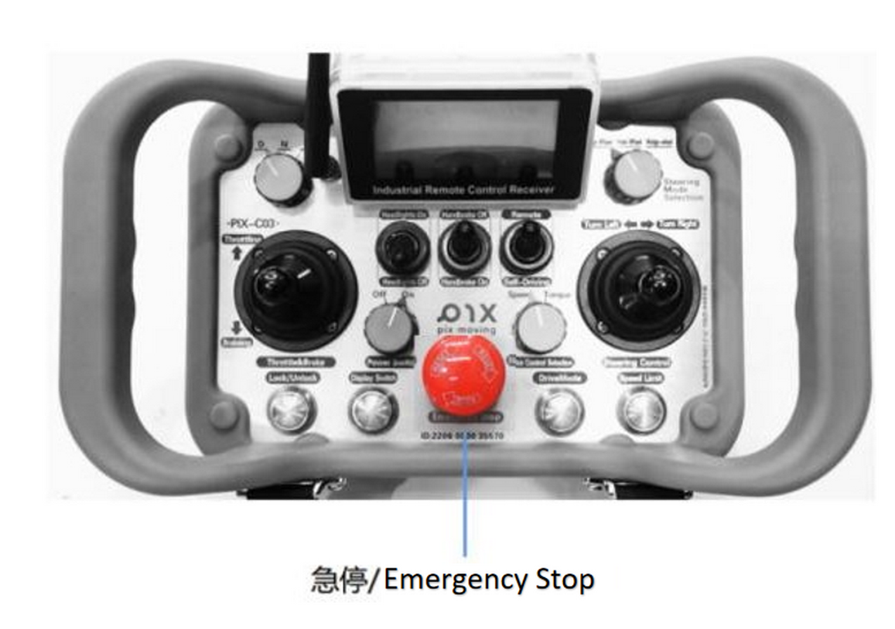
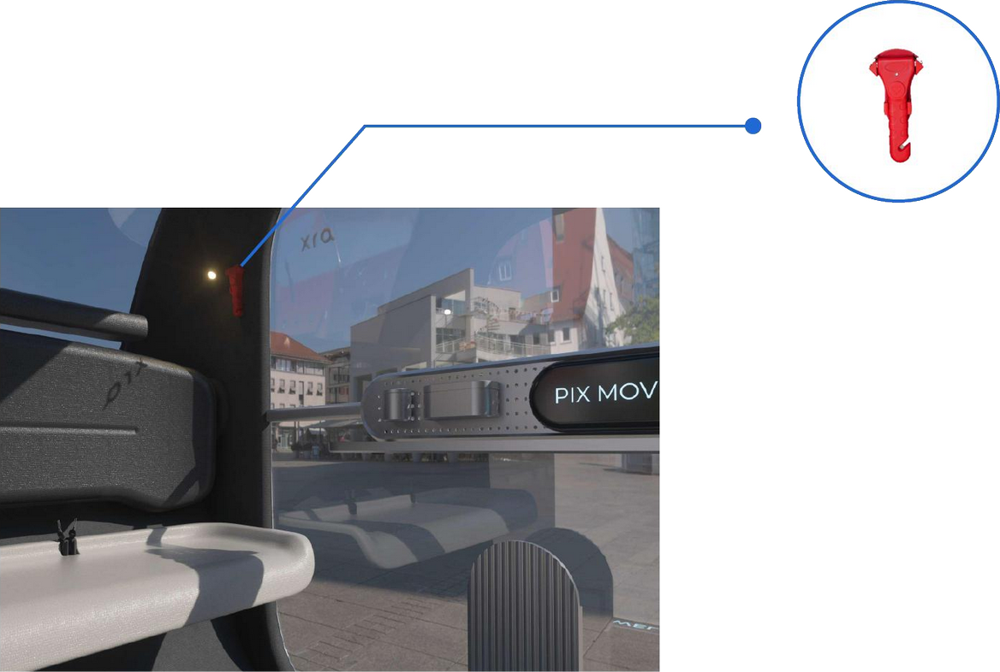
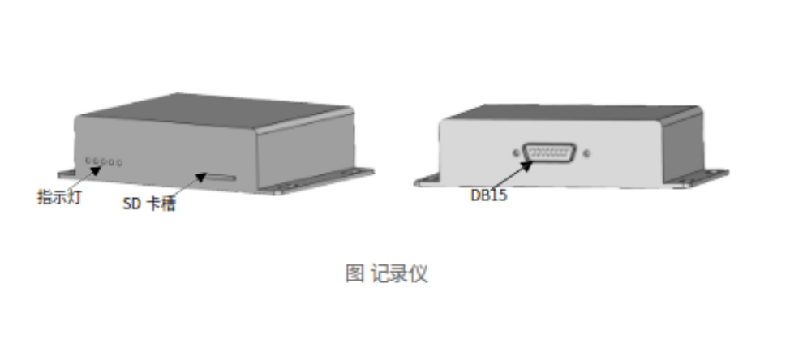

# 产品介绍

## 使用须知

1. 不正当使用PIX Moving的车辆存在一定风险，请在保证人身安全的前提下正确使用。
2. 使用车辆前务必熟悉急停按键位置及使用方式，以便能够在发生意外状况时正确启用安全保护功能。
3. 任何PIX Moving的车辆均不能在完全脱离人员监管的情况下使用。
4. 禁止在超出本产品使用范围的环境下使用本产品。
5. 在使用本产品之前，请详细阅读产品使用说明书或参加相关培训，严禁将车辆交予未经操作学习或培训的人员独自操作。
6. 如需在人员密集的街道、超市、商场等场所开展测试工作，应有安全保障措施。例如，在有人员及其它车辆出入的路段设置显眼的提示标志，并在必要时封闭管理车辆运行路段。
7. 由于本产品外观特性，对PIX Moving产品结构不熟悉的人员可能无法分辨车辆前后位置。请站在车辆侧方启动车辆，切换至遥控器D档，缓慢推动加速推杆，在车辆缓慢行驶时辨别车辆前后位置。该过程中，车辆前后10米内禁止人员穿行和停留。
8. 车辆正常运行过程中，禁止任何人员进入车辆行驶前方15米内区域。人工遥控驾驶模式下，操作者须时刻保持车辆处于视线范围以内，并密切关注车辆运行环境变化，及时提醒过往行人注意避让或停车让行；自动驾驶模式下，请提前确认运行路线畅通，及时排除安全隐患及可能导致异常的因素。
9. 车辆在出厂前已经过检验测试，并对其最高车速进行限制。严禁私自更改车辆基本结构或控制软件。若因车辆运行实际情况需对车辆结构参数进行更改，则该更改必须经过PIX Moving进行技术确认，且在PIX Moving专业工程师的指导下进行相关操作。若未经确认，擅自更改车辆导致车辆损害或安全事故，PIX Moving概不承担相关责任。
10. 如果车辆出现如制动失效、转向失效等任何异常问题，必须立即停止使用。为保证人员和财产安全，严禁带故障运行车辆。
11. 车辆在正常运行过程中，非特殊情况应避免使用急停按钮。急停功能作为安全保护环节，在没有安全危险的情况下禁止使用。车辆高速运行过程中突然急停，可能导致车辆机械结构损伤，造成日后运行环节中，发生安全危险时急停失效的隐患。
12. 非专业人员切勿擅自拆解检修车辆。

## 产品概要

RoboBus是一款纯电动无人驾驶巴士，采用分布式中置电机、高度集成化的控制器、高能量磷酸铁锂动力电池以及智能化的自动驾驶套件，是PIX Moving倾力打造的一款智能化自动驾驶产品。

**车辆外观效果**

## 安全使用须知
### 座椅安全带
1. 安全带使用说明：保持正确坐姿，拉出安全带，使安全带腰带部分尽可能低地横跨于髋部。将锁舌插入带扣中，直到听到“咔嗒”声。反方向试拉锁舌，确认锁止成功，并注意不要扭转安全带。

2. 按下带扣上的红色解锁按钮，锁舌自动弹出，安全带即自动收回。如安全带不能自动收回，应拉出检查是否存在扭转。

**注意**

- 在行驶过程中，请保持正确佩戴安全带。系上或解开安全带时，都要确保安全带没有扭转，否则由于宽度缩减，被扭转的安全带无法在碰撞中吸收冲击作用力；
- 车辆行驶前，应确保所有乘客均已正确系好安全带，以在紧急制动或碰撞事故发生时，保护乘客的生命安全。车辆行驶时，若安全带未正确佩戴，则车辆会持续发出语音提示；
- 车辆上的安全带主要根据成人体型设计，不适用于儿童；
- 安全带腰带部分应尽可能低地横跨于髋部，避免勒住腹部，否则发生事故时安全带勒紧腹部，易导致乘客受伤；
- 安全带应紧贴身体以实现更好的保护作用；
- 每条安全带仅限一人使用。请勿多人 ( 包括儿童 ) 共用一条安全带；
- 定期检查安全带有无切痕、磨损、松动等异常情况；
- 切勿擅自拆卸、拆解、改装安全带；
- 若发生严重事故，事故后即使安全带未出现明显损坏，也应将安全带连同座椅总成一起更换，并进行全面检查；
- 请勿在带扣中插入硬币、回形针等异物，阻碍锁舌和带扣的正确连接；
- 若安全带出现损坏或异常，请勿使用对应座椅，并立即联系售后服务人员进行确认和处理。

### 急停按钮相关
**车内急停**

- 当在行驶过程中发生危急情况，需要紧急停车时，按下车内急停按钮即可立即停车。急停按钮位于车内左侧内饰件上。
- 车辆解除危急情况后，按照急停按钮标识，顺时针旋转解除紧急停车模式。

**遥控器急停按钮**

- 当车辆在遥控模式下行驶，发生危急情况需要紧急停车时，按下遥控器急停按钮即可立即停车。
- 车辆解除危急情况后，按照急停按钮标识，顺时针旋转解除紧急停车模式。

**安全锤操作使用**

- 紧急情况下，取下固定在车内右后方立柱上的安全锤，敲开侧方玻璃或天窗玻璃作为应急逃生出口。
- 敲击玻璃边缘，更安全有效。

**警告**：

- 动车前请注意检查安全锤配备是否完整和正常。
- 切勿让儿童取下安全锤玩耍，否则可能导致儿童受伤。
- 禁止直接接触玻璃碎片，否则有受伤风险。
### 数据记录系统
车辆数据记录系统主要用于完成车辆运行过程中的重要数据实时收集与存储，存储的数据尤其可用于事故分析和责任判定。

**提取记录仪中的车辆数据**：

- 该系统产生的数据文件存在设备的SD卡中，如需提取数据记录仪中的文件，需使用卡针轻轻插入卡槽开启口，卡槽会自动弹出，从设备中取出SD卡。

- 把SD卡插入专用读卡器中（客户自备），然后把读卡器插入到电脑就可以进行文件数据的提取和拷贝。

- 客户提取到文件，联系PIX Moving售后服务中心解析和分析。

功能指示灯说明：

**A** 系统正常运行状态：

- 左1指示灯常亮：代表电源供电状态正常且SD卡已正常插入。

- 在1常亮的状态下，观察左2、左3、左4灯规律闪烁：代表系统工作正常，正在记录数据。

**B** 系统异常运行状态：

- 左1指示灯不亮：代表记录电源供电异常。

- 故障排查步骤为：①检查是否有电源给数据系统正常供电；②检查电源接口DB15是否接触不良。

- 左1指示灯间隔3s连续闪烁:代表正常上电，但SD卡插入不正常。

- 故障排查步骤为：按照2.5.1中操作步骤将SD卡取出后间隔10s,再次插入数据记录系统SD卡位中，等待5s后检查左1指示灯是否变为常亮。如此步骤不能解决该问题，请联系PIX Moving售后服务中心。

