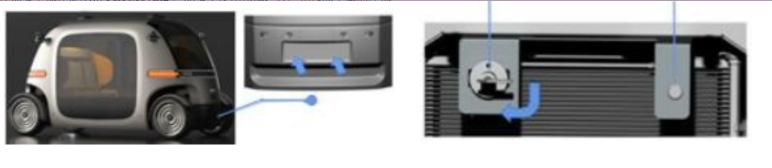
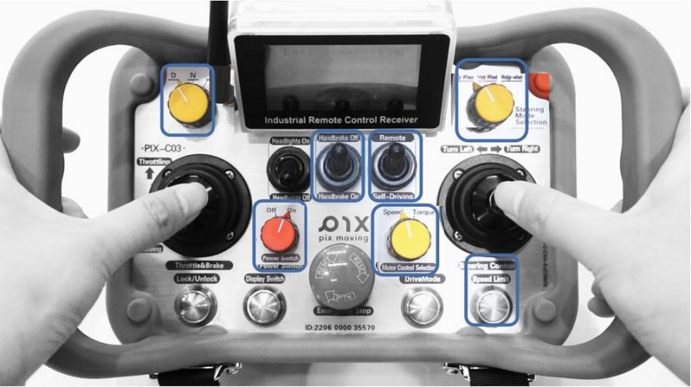
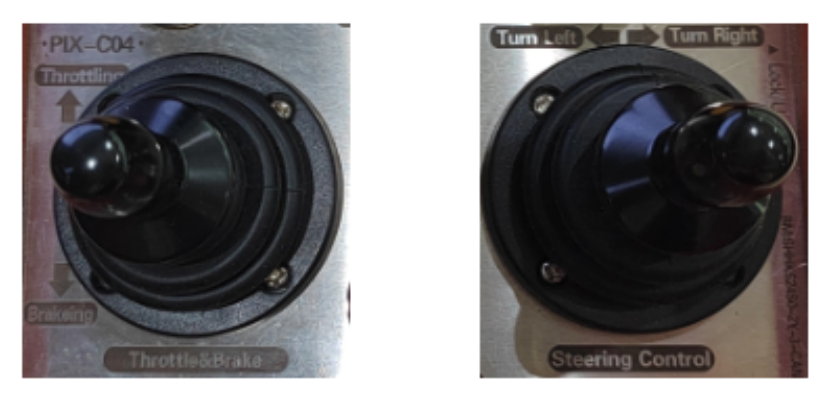
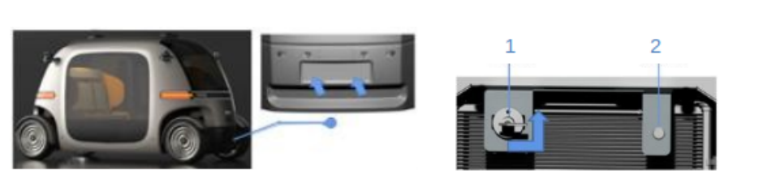
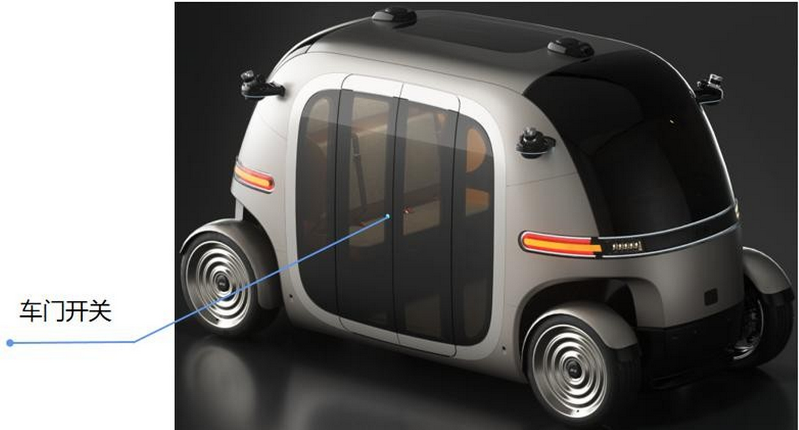
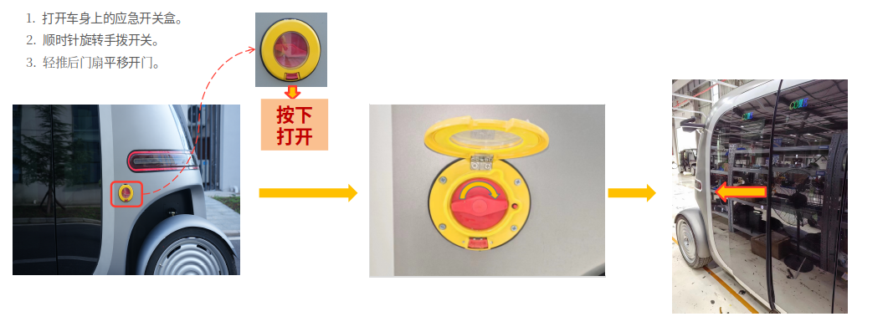
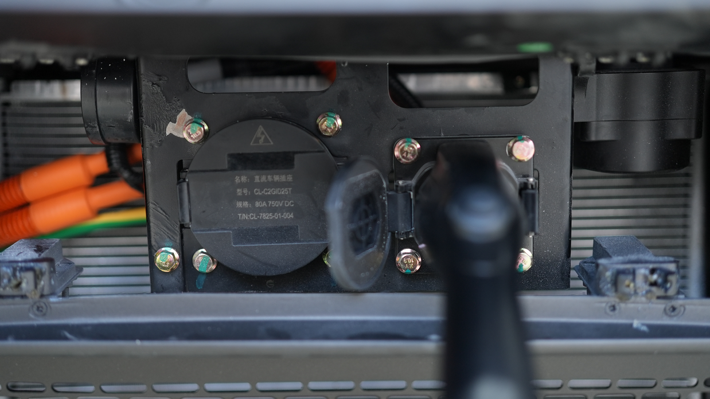
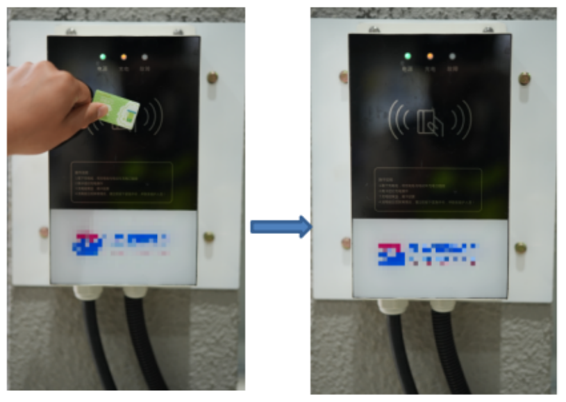

# 车辆操作使用
## 遥控器使用
车辆可以通过便携遥控器操控，以实现车辆的移动和驻车，请在操作车辆前阅读遥控器安全操作提示和PIX Moving产品安全使用须知，并严格按照下属顺序操作。

**车辆启动**

- 按照图示车头牌照框位置，双手轻按盖板下侧，放开双手盖板自动弹出；
- 掀开盖板后顺时针旋转总电源开关，旋转9*0°打开；
- 常电开关开启后，按下启动开关，启动车辆，启动成功后此开 关灯光显示绿色，不显示绿色即未启动成功。
- 打开开关后车辆进入上电自检，等待5S后可开始使用。

**遥控启动**：遥控能够控制车辆的转向，制动，驻车，行驶等功能。

- 旋转无线遥控器电源开关至ON档，开启遥控器；
- 档位开关旋至D档（前进档）；
- 控制模式切换为遥控模式Romote；
- 电机控制模式切换为转矩Steering模式；
- 按下速度限制按钮切换到低速Lowspeed模式，遥控器屏幕上显示Lowspeed提示;
- 右上角转向模式切换为四轮转向Four wheel;
- 遥控器上电完成，将驻车拨杆拨到Off, 解除驻车进入遥控接管模式。

**遥控模式下车辆行驶**：按照上述操作确认按键位置，确认无误即可开始移动车辆。

- 遥控模式下加速与减速：上推遥控器油门/制动摇杆以实现加速操作，下推实现车辆电子制动操作;
- 遥控模式下转向控制：拨动遥控器转向摇杆实现车辆电子转向操作。

**车辆关机**：使用结束后，将车辆停放在合适位置，禁止在斜坡上停车，并按以下流程完成关机。

- 将档位开关置于N档，遥控器驻车拨到Handbrake On,关闭遥控器电源开关；
- 轻轻按压打开位于车身下部的电源开关盖板；
- 掀开盖板后，按下图中2启动开关，关闭车辆，关闭成功此开关灯光熄灭；
- 启动开关关闭后，如果超过10天不使用则逆时针旋转旋转90°关闭图中1车辆总电源开关，车辆下电完毕。

**注意**：请注意操作顺序，避免带电下电对车辆造成损坏。

## 车门系统
1. 乘客使用
该车门具备防夹功能。车门开启与关闭采用按钮操作，其中车内按钮布置在车门内侧的中央，另一个布置在车门外侧的中央。工作方式为短按1秒按钮，门系统进行相应的开、关门动作（每断开机械式总电源开关后重新上电，需短按1秒门按钮激活门控制器）。

2. 乘客门紧急情况时的打开方法
- 车外应急开关和车内应急拉线手柄仅在乘客门无法通过开关门按钮打开或者关闭时使用。
- 应急开关及手柄为拉线式，旋转手拨开关和拉动手柄时需要较大力量强行开启。
- 日常注意检查门泵润滑情况及螺栓、螺母是否松动。

**注意**：车辆出现应急开关门的使用后，需联系PIX Moving售后服务中心进行状态确认才能继续使用车门系统。

## 车辆充电使用
1. 车辆充电
- 在车辆充电前，请按照PIX Moving《7KW充电桩安装规范》进行充电桩的安装，并仔细阅读充电桩使用说明书；
- 车辆下电，机械开关处于打开状态。

- 把IC卡靠在充电桩扫描位置上扫描，刷卡“滴”声响应完毕后移开IC卡，充电桩随即开启充电，充电指示灯黄灯常亮。

2. 结束车辆充电
- 车辆充电过程中需要手动停止充电时，再次刷卡，结束本次充电，充电指示灯熄灭；车辆充电过程中如遇突发情况可以按下充电桩右侧的“急停按钮”。
- 车辆充电完成并由充电桩系统自动切断电流后，右手握紧充电枪把手，拇指按下解锁按钮，均匀用力将充电枪垂直拔出；
- 将充电座的弹盖、充电舱门关闭好，把充电电缆及充电枪收回指定位置放好。

**安全注意事项**

- 充电机的安装严格按照PIX Moving《7KW充电桩安装规范》进行
- 充电位置附近严禁堆放易燃易爆物品，严禁占用应急通道。
- 开启充电机前需保证充电机连接无故障，牢固可靠，不存在短路等故障，线缆绝缘良好无破损，严禁使用锐利物体操作充电机。
- 充电过程中严禁对车辆进行与充电无关的任何操作，不得检修车辆，不得移车，严禁拔出高压维修开关，严禁挪动充电机。
- 充电结束后必须先关闭电源才能拔出充电枪，且充电枪需放到指定位置，注意防水防尘；车辆充电插座盖子盖好；严禁带电插拔充电枪。
- 充电设施周围应备有干粉灭火器并对相关操作人员进行使用方法培训，确保出现火灾或其他情况时操作人员能正确处理。
- 严禁雨雪天气进行露天充电作业。
- 夏季天气高温、干燥，易引发火灾，注意充电环境通风并尽量避免阳光直射。
- 环境温度45℃以上时禁止充电。
- 使用充电设备的有些模块内部可能会产生电火花，为避免出现意外，请不要在加油站、有易燃气体或液体的地方进行充电作业。