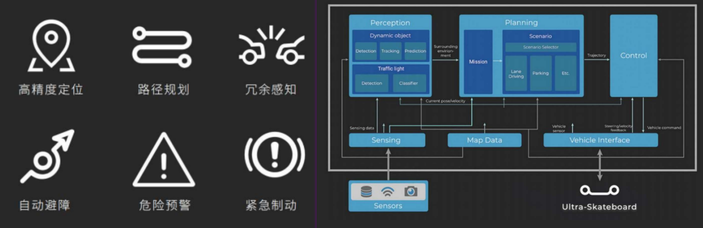

# 自动驾驶软件结构
- PIX Rover-自动驾驶软件架构

PIX为您提供完善的区域内L4级自动驾驶系统集成服务。自动驾驶系统模块是车辆的核心，该模块内部集成车辆自动驾驶软硬件平台，并能与上述模块进行实时通讯与数据传输。该模块旨在指挥车辆的实时动作、处理实时响应需求、并采用冗余方案的设计，预留人工接管、远程接管、一键制动机制，保证运营安全。

## 目录
- [高精度地图文件](./高精度地图文件.md)
- [自动驾驶运营](./自动驾驶运营.md)