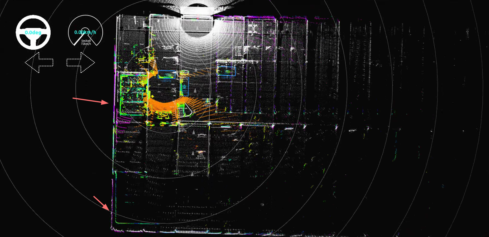
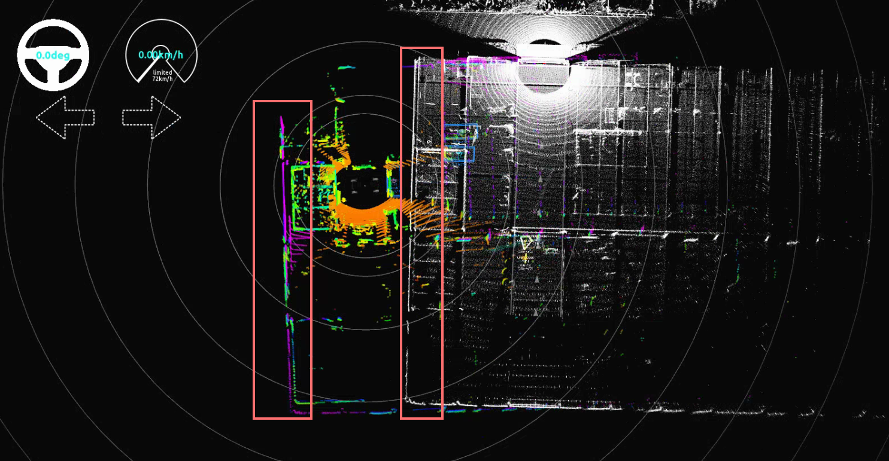
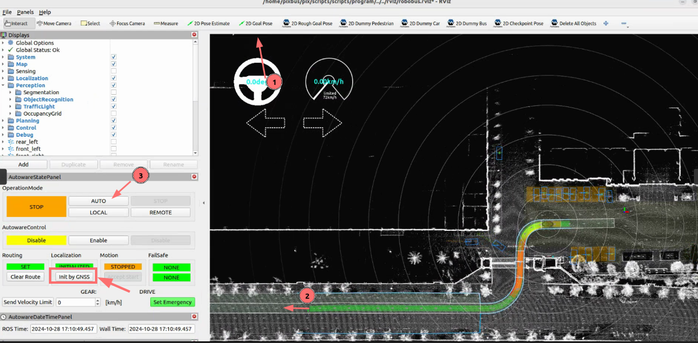
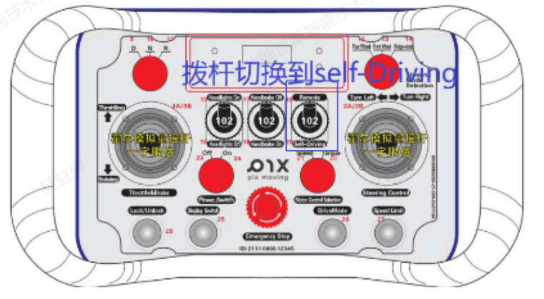
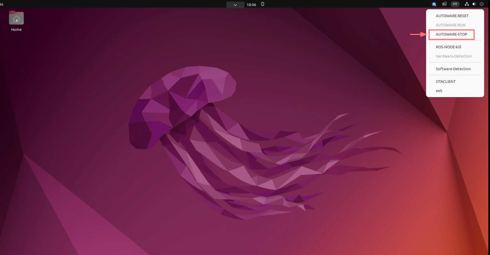
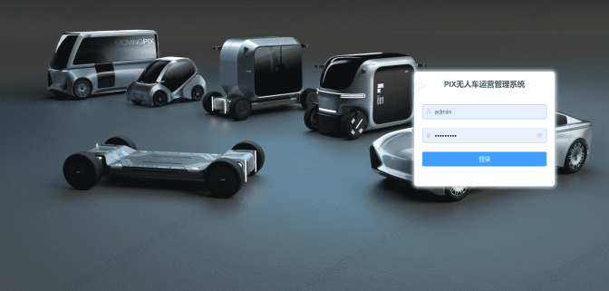
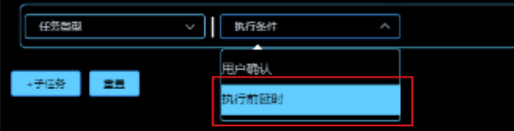
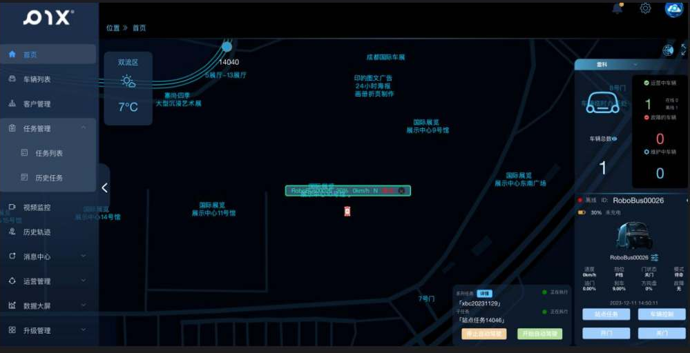

# 自动驾驶运营
**地图文件完成**

1. 右上角点击PIX，然后点击RESET检查系统，显示脚本执行成功后点击RUN，等待自动驾驶启动,自动驾驶进度条

- RVIZ启动成功，激光点云显示正常

**定位检查**

- 启动完成后会出现点云，然后检查定位是否正常
- 正常定位,当彩色点云和白色点云地图的固定建筑基本重合后表示定位正常;

- 定位异常状态，彩色的实时点云和点云地图建筑分离此时为定位失败状态;

- 不成功重新定位，使用rviz控制面板的initbyGNSS按钮重新定位；然后检查是否定位成功，不成功重复定位，每次点击该按钮需要间隔等待30秒左右。

**自动驾驶运营**

- 设定目标站点，单击2D Goal Pose工具栏上的 按钮，然后点击车辆到达目标位置（方向和车道方向一致）；
- 操作正确后，您将看到从初始姿势到目标姿势的规划路径；
- 单击中AUTO的按钮，然后遥控器放权，车辆将沿着规划路径行驶

**注意1**:车辆运营前选择周围空旷且无多余障碍物的地方；

**注意2**：运营设置车辆速度，对车辆不熟悉的建议速度设置在5km/h以下；

**注意2**：驱散车辆周围人群或小动物，以车辆为中心，5m内不得有行人或其余车辆。
 
**关闭自动驾驶**

- 关闭自动驾驶程序,单击AUTOWARE-STOP按钮。

# 附云控平台（海外暂不支持）

- 云控平台下发任务：使用云控平台下发自动驾驶任务，详见云控平台使用手册

1. 当云控平台下发任务以后，查看任务是否下发成功，成功会出现绿色的行驶路线，不成功重新下发；
2. 当下发的任务执行条件为延迟执行时，等待延迟时间到达，自动驾驶会启动；

3. 当下发的任务执行条件为用户确认时，需要用户在ipad上点击开始自动驾驶按钮，才会启动;
