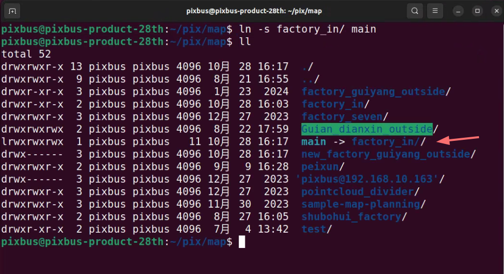

# 高精度地图文件
- PCD文件：数据采集建图生成点云地图
- lanelet2文件：矢量地图，根据相关道路信息绘制
- yaml文件：建图时会输出坐标原点信息
- station文件:运营路线站点信息（可选）
1. 启动终端在地图文件夹下创建新的文件，将以上文件放到新建文件夹下；


```
PCD文件名：pointcloud_map.pcd
lanelet2文件名：lanelet2_map.osm
yaml文件名：map_projector_info.yaml
station文件名：stations.yaml (可选)
```
**注**：请严格按照文件名命名，否则地图无法加载出来。
2. 将地图文件软连接到main文件夹
- E：将factory_in文件软连接到main


```
ln -s factory_in/ main 
```
