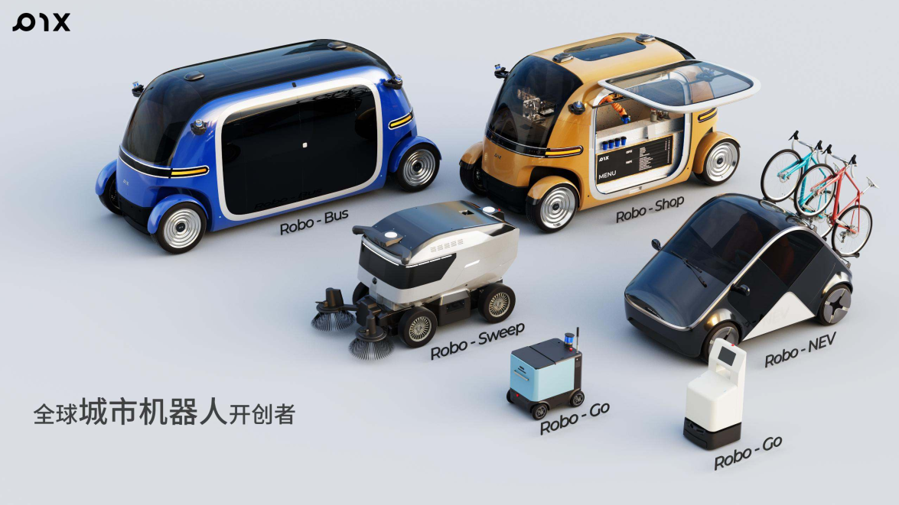
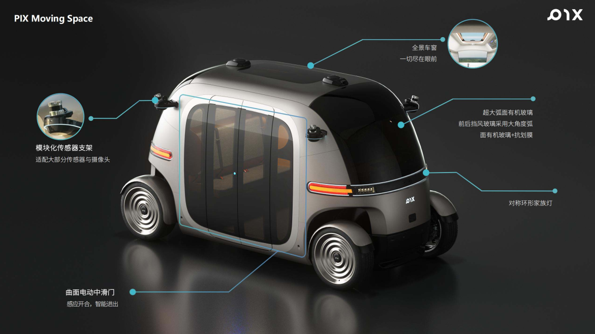
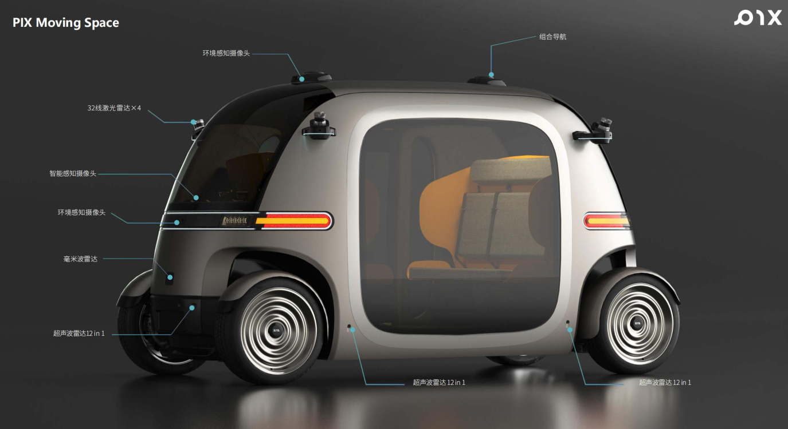
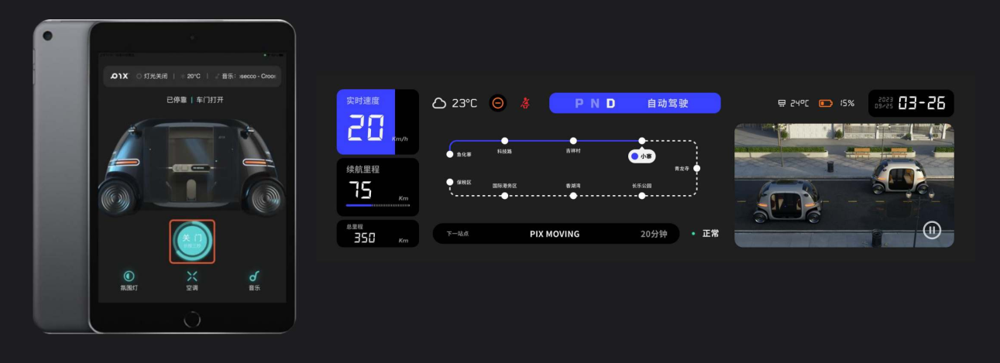
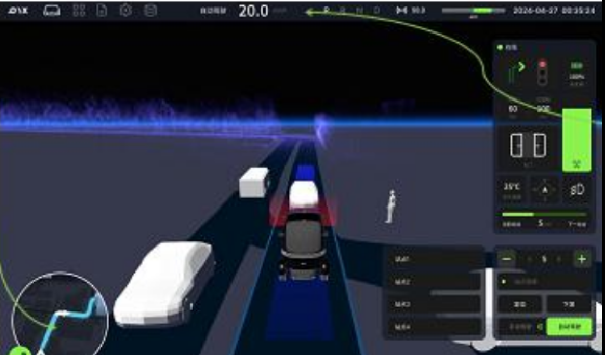
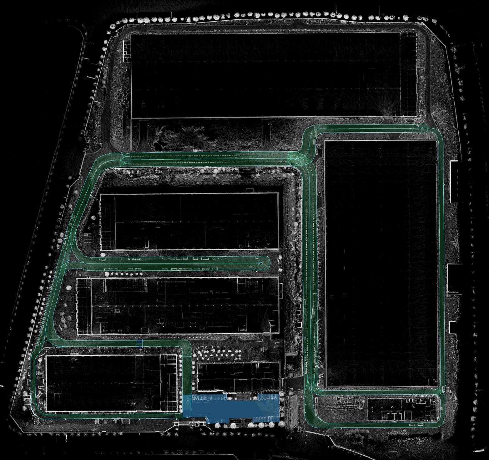
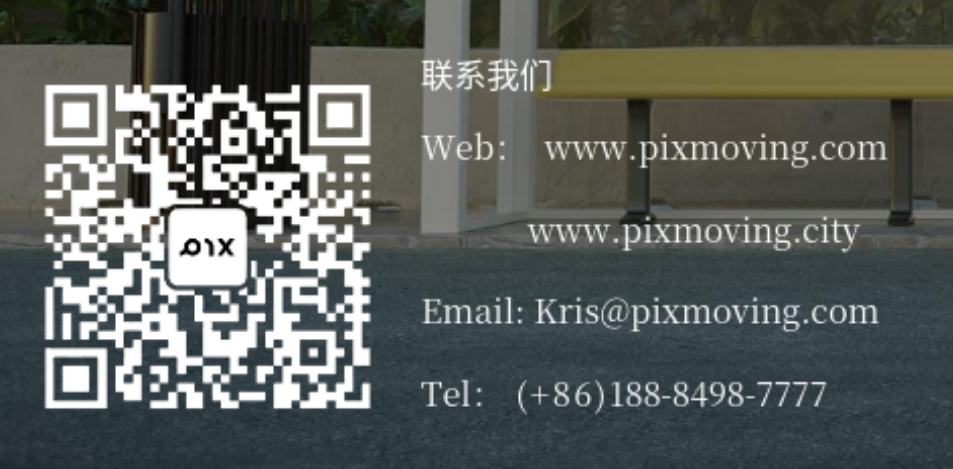

<!--
 Copyright 2023 Pixmoving, Inc.
 
 Licensed under the Apache License, Version 2.0 (the "License");
 you may not use this file except in compliance with the License.
 You may obtain a copy of the License at
 
     http://www.apache.org/licenses/LICENSE-2.0
 
 Unless required by applicable law or agreed to in writing, software
 distributed under the License is distributed on an "AS IS" BASIS,
 WITHOUT WARRANTIES OR CONDITIONS OF ANY KIND, either express or implied.
 See the License for the specific language governing permissions and
 limitations under the License.
-->

# Pixmoving Inc

## Who Are We
[PIX Moving](http://www.pixmoving.city)成立于2017年，是全球城市机器人的开创者，核心产品有Robo-Bus、Robo-Shop、Robo-EV、Robo-Sweep等机器人，目前产品进入到欧洲、北美、南美、东南亚以及日韩等全球30多个国家。团队成员200多人，来自意大利、美国、印度以及日本等7个国家，研发人员占比超过58%。技术创新是PIX快速发展的核心动力，目前已在中国、欧洲、美国申请专利200多项，因此，也被达沃斯论坛评选为"全球100家最具发展潜力的技术先锋企业"，中国有12家企业上榜。截止目前，PIX已经获得硅谷风险投资基金SOSV、日本上市公司TIS株式会社以及中国A股上市公司勘设股份等投资。

## Robo-Bus小巴
- 城市有机体：以圆润和谐的设计美学塑造具有未来感且赏心悦目的外观。以贴近与人的细节感知，为乘客塑造安全与舒适的出行体验;
- 多场景适配：可根据场景的变化适配车辆配置和技术方案;
- 多重安全冗余：以安全为首位，致力于为乘客提供舒适多元的通勤体验;
- 云平台：运营平台涵盖在线车队管理，数据监控，固件升级等30＋功能；
- 双向设计：双向设计，前后对称环形大灯配合简约舒适内饰带来全新体验；
- 智慧出行：车内智能交互系统，轻松一键出行，车速路线实时掌控；
- L4级自动驾驶：多传感器融合，为不同场景的自动驾驶保驾护航
                     

### 自动驾驶系统构成 

#### 1.传感器套件
- 车辆出口多个国家，当您收到车辆时传感器可能存在差异，请以实物为标准

#### 2.交互平台
- 车载大屏:显示车辆状态信息

- 操控界面：人机交互，安全员操作界面

#### 3.高精度地图制作
- 点云地图

- Lanelet2地图

### 自动驾驶软硬件文档支持
- [Robo-Bus用户说明书](./Robo-Bus用户说明书/)
- [自动驾驶传感器硬件检查](./自动驾驶传感器硬件检查/)
- [高精度地图数据采集](./高精度地图数据采集/)
- [Robo-Bus自动驾驶运营](./Robo-Bus自动驾驶运营/)

## 联系我们
RoboBus是由PIX Moving打造的纯电动线控无人巴士，支持遥控器驾驶和自动驾驶双重驾驶模式。如使用过程中您需要咨询任何问题，请联系PIX Moving售后服务中心以获取最新的售后服务。对PIX或我们所提供的产品感兴趣，请随时与我们取得联系。 
PIX 期待与全球跨领域的企业、组织、先行者们建立合作，共同致力于汽车产业与城市的创新变革。

- 生态合作：<chase@pixmoving.com>
- 商务合作：<sean@pixmoving.com>
- 媒体报道：<yoki@pixmoving.com>
- 获得更多关于产品的信息：

