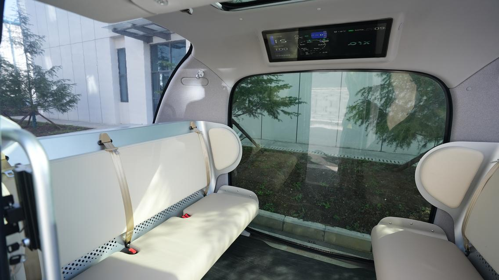
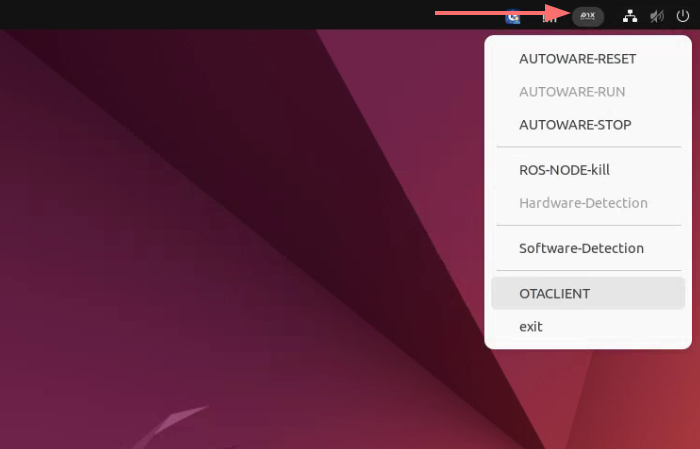
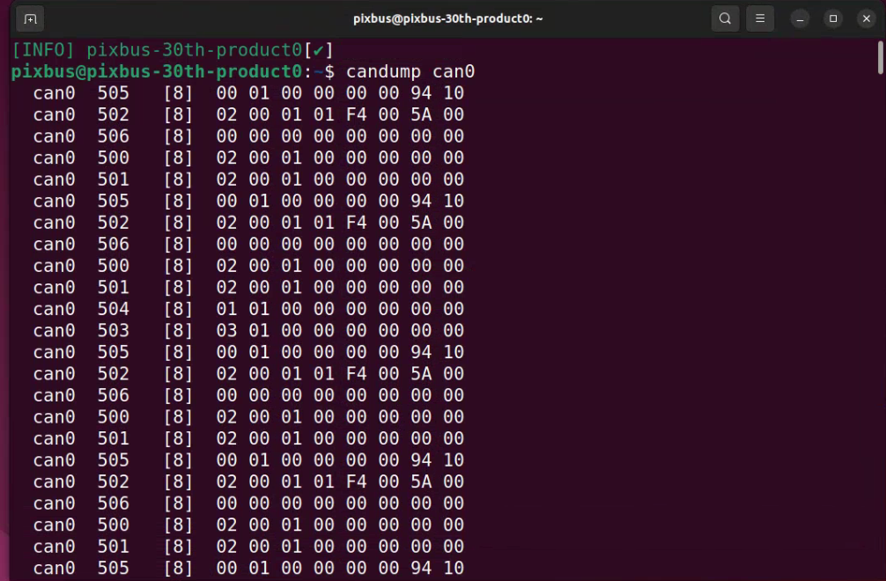
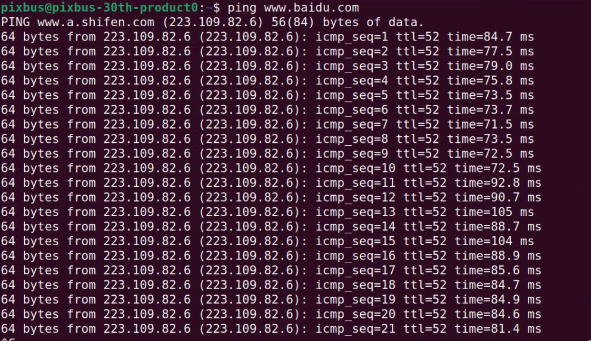
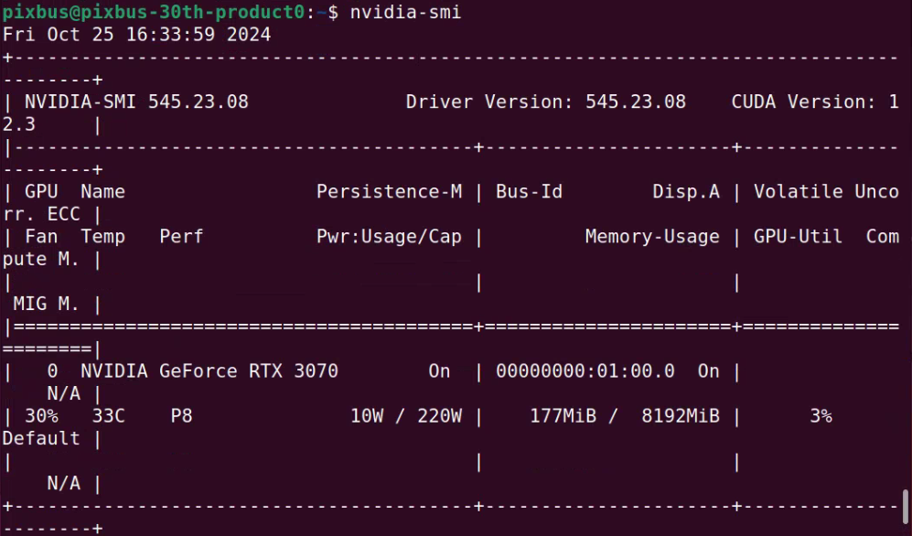

# IPC运营
## 设备接线
- 车内显示屏与IPC连接，提供可视化界面



## IPC设备检查
- 车辆上电后，稍等几秒进入界面；


- 自动驾驶启动按钮：位于右上角PIX图标，选中后点击即可出现下拉菜单



1. RESET:检查自动驾驶系统是否正常，启动自动驾驶前先RESET；
2. RUN：RESET后点击RUN开始运营自动驾驶系统，等待系统运营；
3. STOP：当自动驾驶运营完成后关闭自动驾驶系统；
4. kill: STOP自动驾驶出现异常节点，点击kill强行结束；
5. Hardware：自动驾驶相关硬件检查；
6. Software: 自动驾驶祥光软件检查；
7. OTA：系统升级，还在开发中，暂时无法使用；
8. exit: 退出PIX界面，请勿使用。

- Ctrl+Alt+t 启动终端：用户名：pixbus，用户名密码：pixmoving
- 检查底盘数据通讯是否正常
```shell
candump can0
```
- 终端输出数据正常

- 网络通讯是否正常

- 检查显卡驱动是否正常

