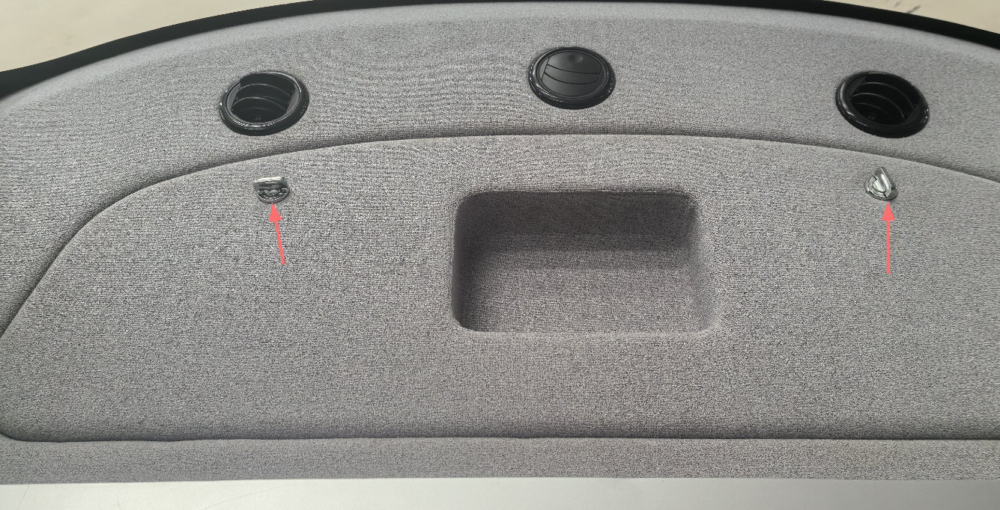
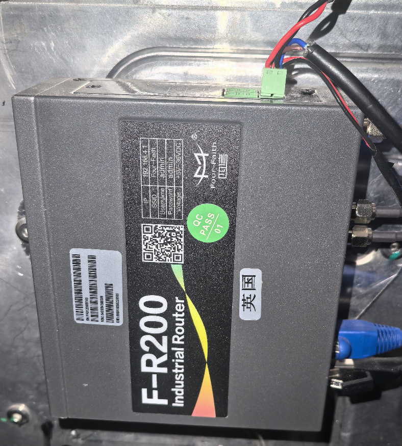
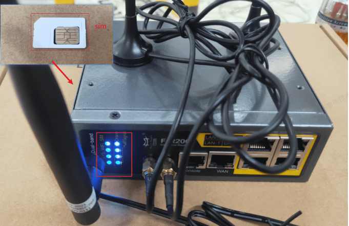

# 路由器硬件检查
- 国内robobus路由器在后舱左侧，国外robobus路由器在前舱左侧（港澳），打开舱体盖板即可看到；

-  打开后盖板，取下路由器的电源线，用螺丝刀将放置SIM卡的铁片取下，插入SIM卡，上电后指示灯全部正常显示，表示连网成功，可正常使用网络；

- 路由器参考使用手册。
    [F-R200](./image/F-R200.pdf)

**注意**：在设备启动前找到路由器，准备物联网卡（海外客户需自行准备物联网卡，包含港澳）。

