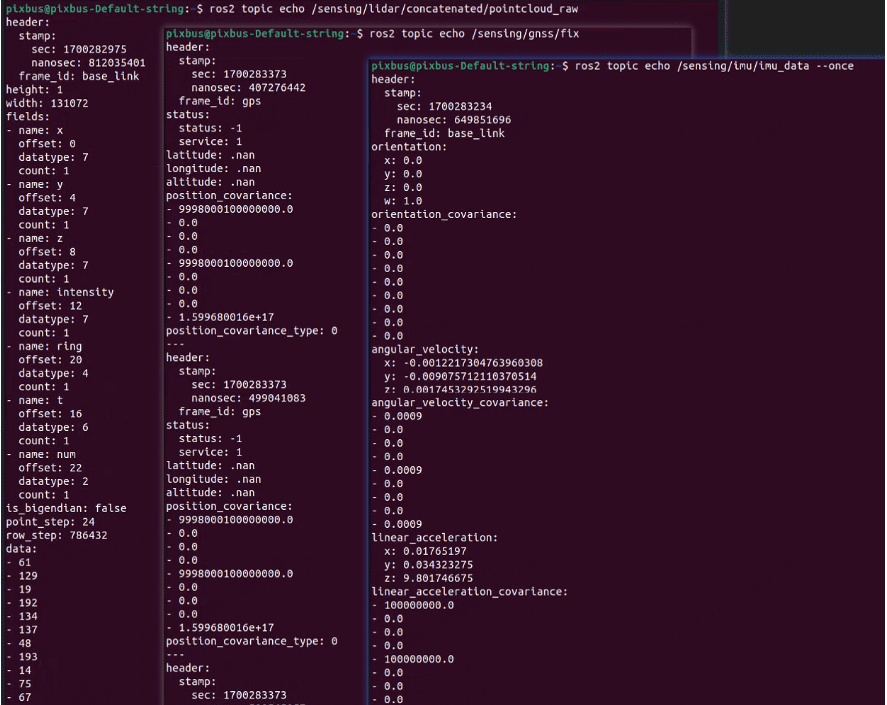
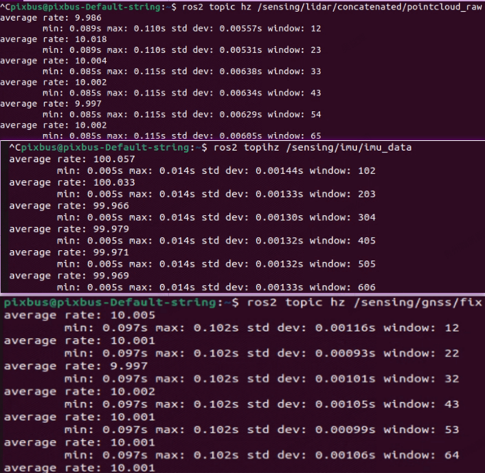
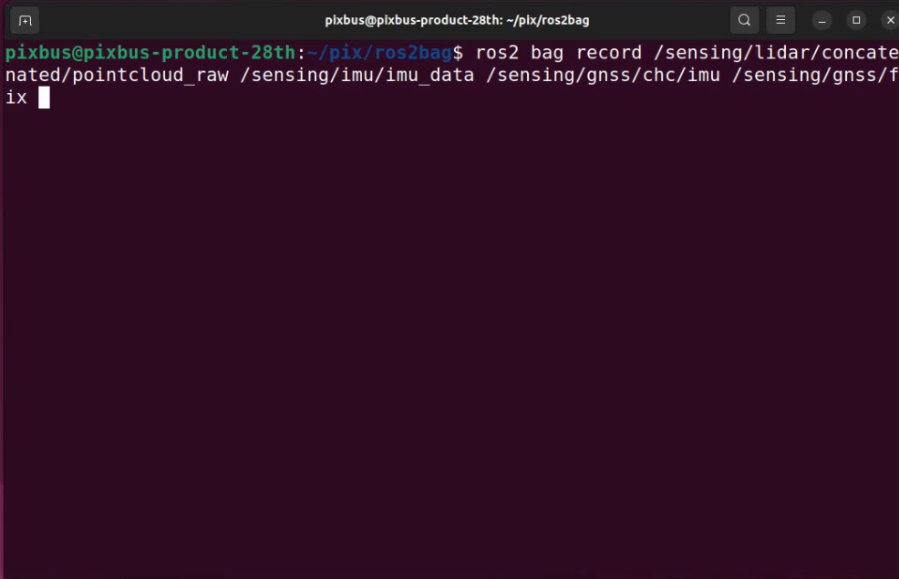

# 高精度地图制作
## 数据采集前准备
1. IPC网络连接正常；
2. 四个雷达数据与IPC通讯正常；
3. RTK登录，GNSS校准成功；
4. 底盘can通讯正常。

## 启动自动驾驶系统
1. 右上角点击PIX，然后点击RESET检查系统，显示脚本执行成功后点击RUN，等待自动驾驶启动,自动驾驶进度条


- RVIZ启动成功，激光点云显示正常


2. 检查以下话题数据
```
/sensing/lidar/concatenated/pointcloud_raw    *观察字段是否显示完整*
/sensing/imu/imu_data
/sensing/gnss/fix
```
- 获取话题数据，检查数据是否正常，输出频率是否正常
1. 融合点云数据输出正常，且输出频率为10Hz
2. Imu数据正常，且输出频率为100Hz
3. Fix数据正常，且输出频率为10Hz
```
ros2 topic echo /sensing/lidar/concatenated/pointcloud_raw
ros2 topic echo /sensing/imu/imu_data
ros2 topic echo /sensing/gnss/fix
```

```
ros2 topic hz /sensing/lidar/concatenated/pointcloud_raw
ros2 topic hz /sensing/imu/imu_data
ros2 topic hz /sensing/gnss/fix
```


**注意**：一定要按照要求进行检查，否者会导致建图失败。

## 开始录制话题数据
1. 打开终端进入到该目录
```
ros2 bag record /sensing/lidar/concatenated/pointcloud_raw /sensing/imu/imu_data /sensing/gnss/fix
```


- 将车辆移动到需要运营自动驾驶的路线上；
- 根据运营路线进行数据采集，开启录制数据脚本后车辆在原地等待10秒左右等待imu数据收敛后开始运营车辆，红绿灯地方可以停止等待。数据采集过程车辆应匀速行使，且车速不得高于15km/h，转弯处速度不得高于8km/h，尽量避免突然加速；
- 录制数据过程一定要进行回环检测，避免imu无法收敛点云数据，导致建图失败。
2. 数据处理
- 数据录制完成后查看数据大小，如果超过2G请将数据进行分割，2G一个包；
- 数据分割完成后，请联系PIX工程师，将数据上传到PIX服务器进行建图；
- 大概1个工作日后PCD地图完成。
